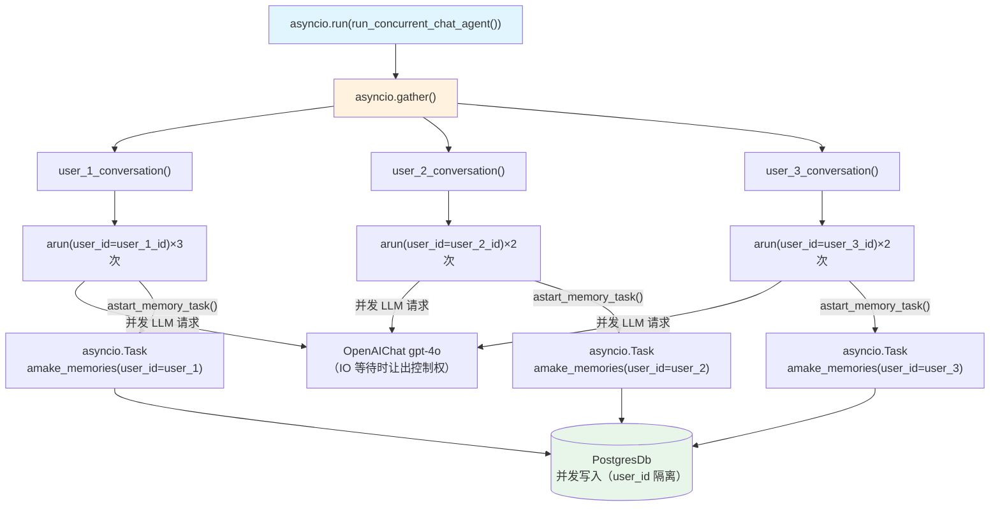

# 06_multi_user_multi_session_chat_concurrent.py — 实现原理分析

> 源文件：`cookbook/11_memory/06_multi_user_multi_session_chat_concurrent.py`

## 概述

本示例展示 Agno 的 **并发多用户对话 + 记忆隔离** 机制：通过 `asyncio.gather()` 同时运行多个用户的对话协程，每个用户的记忆独立隔离，框架保证并发写入时的 user_id 隔离不会产生数据混淆。

**核心配置一览：**

| 配置项 | 值 | 说明 |
|--------|------|------|
| `model` | `OpenAIChat(id="gpt-4o")` | Chat Completions API |
| `db` | `PostgresDb(db_url=...)` | 持久化存储（多协程共享） |
| `update_memory_on_run` | `True` | 每次运行后提取记忆 |
| 并发方式 | `asyncio.gather()` | 三个用户对话协程并行 |

## 架构分层

```
用户代码层                              agno.agent 层（并发执行）
┌──────────────────────────────────┐   ┌────────────────────────────────────────────────┐
│ run_concurrent_chat_agent()      │   │  协程1: chat_agent._arun(user_id=user_1_id)    │
│                                  │   │  协程2: chat_agent._arun(user_id=user_2_id)    │
│ asyncio.gather(                  │──>│  协程3: chat_agent._arun(user_id=user_3_id)    │
│   user_1_conversation(),         │   │                                                │
│   user_2_conversation(),         │   │  每个协程独立管理自己的 user_id                 │
│   user_3_conversation(),         │   │  后台异步任务: astart_memory_task()            │
│ )                                │   │    → asyncio.create_task(amake_memories(...)) │
└──────────────────────────────────┘   └────────────────────────────────────────────────┘
                                                  │ 并发写入（user_id 隔离）
                                       ┌──────────┴──────────────────┐
                                       │ PostgresDb                   │
                                       │   user_1@... → [记忆列表]    │
                                       │   user_2@... → [记忆列表]    │
                                       │   user_3@... → [记忆列表]    │
                                       └──────────────────────────────┘
```

## 核心组件解析

### asyncio.gather — 真正的并发执行

与第 5 个示例的串行 `await` 不同，`asyncio.gather()` 在同一事件循环中并发调度三个协程：

```python
async def run_concurrent_chat_agent() -> None:
    # 三个用户对话协程同时进行
    await asyncio.gather(
        user_1_conversation(),
        user_2_conversation(),
        user_3_conversation()
    )
```

当一个协程在等待 LLM 响应（IO 等待）时，其他协程可以运行，充分利用异步 IO 特性。

### 并发安全的记忆写入

在异步模式下，记忆提取走 `astart_memory_task()`（`_managers.py:L139`），创建独立的 asyncio Task：

```python
# _managers.py L164-173
if (
    run_messages.user_message is not None
    and agent.memory_manager is not None
    and agent.update_memory_on_run
    and not agent.enable_agentic_memory
):
    log_debug("Starting memory creation in background task.")
    return create_task(amake_memories(agent, run_messages=run_messages, user_id=user_id))
```

由于每个记忆任务携带独立的 `user_id`，并发写入 PostgresDb 时通过数据库的 user_id 字段天然隔离，不会产生混淆。

### 同一 Agent 实例服务多用户

`chat_agent` 是单例对象，通过 `user_id` 和 `session_id` 参数区分用户和会话：

```python
# user_1 的对话
await chat_agent.arun("...", user_id=user_1_id, session_id=user_1_session_1_id)

# user_2 的对话（同一 chat_agent 实例）
await chat_agent.arun("...", user_id=user_2_id, session_id=user_2_session_1_id)
```

Agent 实例本身是无状态的（或状态通过 run_context 传递），支持并发调用。

### 与串行版的对比

| 维度 | 串行版（05） | 并发版（06） |
|------|------------|------------|
| 执行方式 | 顺序 `await` | `asyncio.gather()` |
| 适用场景 | 调试、顺序依赖 | 生产高并发场景 |
| 记忆任务 | `start_memory_future()`（线程池） | `astart_memory_task()`（asyncio Task） |
| 并发模型 | 异步 IO + 后台线程 | 纯异步 IO + 异步任务 |

## System Prompt 组装

与 `05_multi_user_multi_session_chat.py` 相同：system prompt 为空（未设置 instructions 和 add_memories_to_context）。

## 完整 API 请求

```python
# 三个协程并发发起请求
# user_1 协程：
client.chat.completions.create(
    model="gpt-4o",
    messages=[{"role": "user", "content": "My name is Mark Gonzales and I like anime and video games."}]
)
# user_2 协程（同时进行）：
client.chat.completions.create(
    model="gpt-4o",
    messages=[{"role": "user", "content": "Hi my name is John Doe."}]
)
# user_3 协程（同时进行）：
client.chat.completions.create(
    model="gpt-4o",
    messages=[{"role": "user", "content": "Hi my name is Jane Smith."}]
)
# 以上三个请求在事件循环中并发调度
```

## Mermaid 流程图



## 关键源码文件索引

| 文件 | 关键函数/类 | 作用 |
|------|------------|------|
| `agno/agent/_managers.py` | `astart_memory_task()` L139 | 创建异步记忆任务 |
| `agno/agent/_managers.py` | `amake_memories()` L84 | 异步记忆提取执行体 |
| `agno/memory/manager.py` | `acreate_user_memories()` | 异步版批量创建记忆 |
| `agno/db/postgres/` | `PostgresDb` | 并发安全的持久化存储 |
