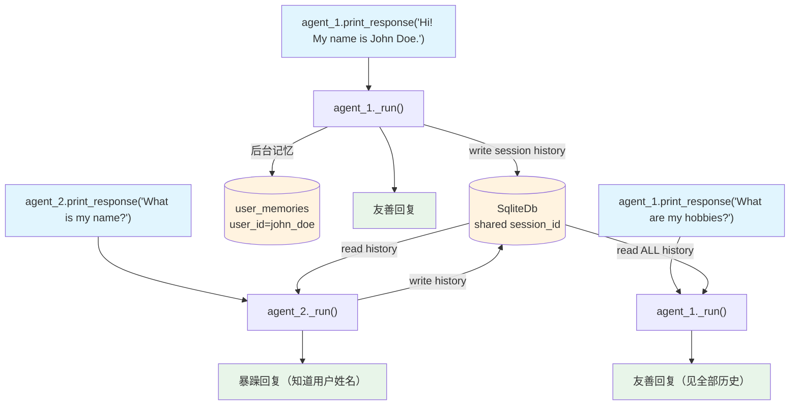

# 07_share_memory_and_history_between_agents.py — 实现原理分析

> 源文件：`cookbook/11_memory/07_share_memory_and_history_between_agents.py`

## 概述

本示例展示 Agno 的 **多 Agent 共享历史记录 + 共享记忆** 机制：两个具有不同角色（友善助手 vs 暴躁助手）的 Agent 通过共享 `db`、`session_id`、`user_id`，实现对话历史和用户记忆的完全共享。任意一个 Agent 的对话内容对另一个立即可见。

**核心配置一览：**

| 配置项 | agent_1 | agent_2 |
|--------|---------|---------|
| `model` | `OpenAIChat("gpt-4o-mini")` | `OpenAIChat("gpt-4o-mini")` |
| `instructions` | "You are really friendly and helpful." | "You are really grumpy and mean." |
| `db` | `SqliteDb("tmp/agent_sessions.db")` | 同一 db 实例 |
| `add_history_to_context` | `True` | `True` |
| `update_memory_on_run` | `True` | `True` |

## 架构分层

```
用户代码层                              agno.agent 层
┌──────────────────────────────────┐   ┌──────────────────────────────────────────────────────┐
│ 07_share_memory_and_history.py   │   │ agent_1._run(session_id, user_id)                   │
│                                  │   │  ├─ read_or_create_session() → 从 db 加载会话        │
│ session_id = str(uuid4())        │   │  ├─ get_run_messages()                               │
│ user_id = "john_doe@example.com" │──>│  │    get_system_message()                           │
│                                  │   │  │      3.3.9: add_memories_to_context（懒加载记忆）  │
│ agent_1.print_response(...)      │   │  ├─ 步骤3(history): add_history_to_context=True      │
│ agent_2.print_response(...)      │   │  │    读取 db 中 session_id 的历史消息               │
│                                  │   │  ├─ Model.response()                                 │
│                                  │   │  └─ 后台: make_memories(user_id)                    │
└──────────────────────────────────┘   └──────────────────────────────────────────────────────┘
                                                  │ 读/写共享
                                       ┌──────────┴──────────────────┐
                                       │ SqliteDb                     │
                                       │   agent_sessions:            │
                                       │     session_id → 消息历史    │
                                       │   user_memories:             │
                                       │     user_id → 记忆列表       │
                                       └──────────────────────────────┘
```

## 核心组件解析

### add_history_to_context — 跨 Agent 历史共享

`add_history_to_context=True` 使 Agent 在构建消息时从 db 读取该 `session_id` 的历史消息（`_messages.py:L1231`）：

```python
# _messages.py L1231-1262（简化）
if agent.add_history_to_context:
    history = session.get_messages(num_history_runs=agent.num_history_runs)
    # 将历史消息插入到当前消息列表中
    run_messages.extend(history)
```

由于 `agent_1` 和 `agent_2` 使用相同的 `session_id` 和 `db`，它们共享同一条历史记录，因此：
- `agent_2` 可以看到 `agent_1` 写入的消息（用户姓名）
- `agent_1` 可以看到 `agent_2` 写入的消息（爱好）

### update_memory_on_run — 记忆共享

两个 Agent 都配置了 `update_memory_on_run=True` 和相同的 `db`，记忆以 `user_id` 为键，任何 Agent 存储的记忆都对另一个可见。

### instructions 差异化角色

两个 Agent 唯一显著差异在 `instructions`，体现了不同的对话风格：
- `agent_1`："You are really friendly and helpful." → 友善回应
- `agent_2`："You are really grumpy and mean." → 暴躁回应

对话历史和记忆完全共享，但回复风格截然不同，演示了配置隔离 vs 数据共享的设计。

### 开发环境使用 SqliteDb

本例使用 `SqliteDb` 而非 `PostgresDb`，适合本地开发：

```python
db = SqliteDb(db_file="tmp/agent_sessions.db")
```

## System Prompt 组装

以 `agent_1` 为例：

| 序号 | 组成部分 | 值 | 是否生效 |
|------|---------|-----|---------|
| 3.3.3 | `instructions` | "You are really friendly and helpful." | 是 |
| 历史 | `add_history_to_context` | 读取共享会话历史 | 是 |
| 3.3.9 | `add_memories_to_context` | None（未设置） | 否 |

### 最终 System Prompt

```text
You are really friendly and helpful.
```

历史消息通过 `get_run_messages()` 步骤3（`_messages.py:L1231`）注入到消息列表，而非 system prompt。

## 完整 API 请求

```python
# agent_1 第一轮："Hi! My name is John Doe."
client.chat.completions.create(
    model="gpt-4o-mini",
    messages=[
        {"role": "system", "content": "You are really friendly and helpful."},
        {"role": "user", "content": "Hi! My name is John Doe."}
    ]
)

# agent_2 第二轮（能看到 agent_1 的历史）
client.chat.completions.create(
    model="gpt-4o-mini",
    messages=[
        {"role": "system", "content": "You are really grumpy and mean."},
        # 历史：来自 agent_1 的对话
        {"role": "user", "content": "Hi! My name is John Doe."},
        {"role": "assistant", "content": "Hi John! ...（agent_1 的回复）"},
        # 当前问题
        {"role": "user", "content": "What is my name?"}
    ]
)

# agent_1 最后一轮（看到所有历史，包括 agent_2 的对话）
client.chat.completions.create(
    model="gpt-4o-mini",
    messages=[
        {"role": "system", "content": "You are really friendly and helpful."},
        {"role": "user", "content": "Hi! My name is John Doe."},
        {"role": "assistant", "content": "...（agent_1 之前的回复）"},
        {"role": "user", "content": "What is my name?"},
        {"role": "assistant", "content": "...（agent_2 的暴躁回复）"},
        {"role": "user", "content": "I like to hike in the mountains on weekends."},
        {"role": "assistant", "content": "...（agent_2 的暴躁回复）"},
        {"role": "user", "content": "What are my hobbies?"}
    ]
)
```

## Mermaid 流程图



## 关键源码文件索引

| 文件 | 关键函数/类 | 作用 |
|------|------------|------|
| `agno/agent/agent.py` | `add_history_to_context` L127 | 开启跨 Agent 历史读取 |
| `agno/agent/_messages.py` | `get_run_messages()` L1231-1262 | 注入历史消息 |
| `agno/agent/_managers.py` | `make_memories()` L29 | 后台记忆提取（共享 db） |
| `agno/db/sqlite/` | `SqliteDb` | 共享的本地持久化存储 |
