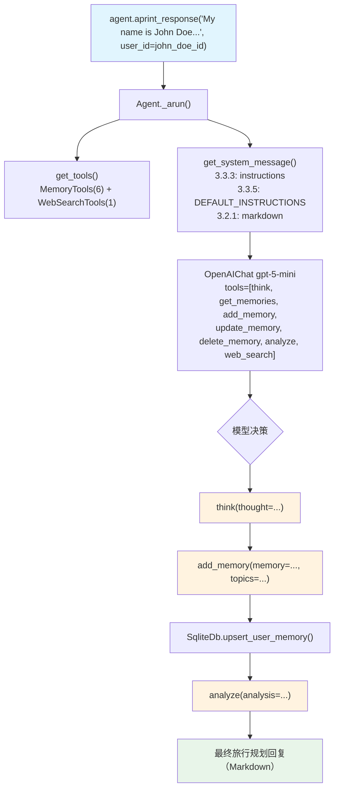

# 08_memory_tools.py — 实现原理分析

> 源文件：`cookbook/11_memory/08_memory_tools.py`

## 概述

本示例展示 Agno 的 **`MemoryTools` Toolkit** 机制：与 `enable_agentic_memory` 不同，`MemoryTools` 是一个完整的 `Toolkit` 子类，提供 think/get_memories/add_memory/update_memory/delete_memory/analyze 六个工具，Agent 可以像使用普通工具一样主动管理用户记忆，同时配合 `WebSearchTools` 完成旅行规划任务。

**核心配置一览：**

| 配置项 | 值 | 说明 |
|--------|------|------|
| `model` | `OpenAIChat(id="gpt-5-mini")` | Chat Completions API |
| `tools` | `[memory_tools, WebSearchTools()]` | 记忆工具 + 网络搜索工具 |
| `instructions` | 4 条指令 | 角色定位 + 工具使用指引 |
| `markdown` | `True` | 格式化输出 |
| `db` | `SqliteDb("tmp/memory.db")` | 记忆持久化存储 |
| `enable_agentic_memory` | False（未设置） | 不走 MemoryManager 路径 |
| `update_memory_on_run` | False（未设置） | 不自动后台提取 |

## 架构分层

```
用户代码层                              agno.agent 层
┌──────────────────────────────────┐   ┌──────────────────────────────────────────────────────┐
│ 08_memory_tools.py               │   │ Agent._arun()                                        │
│                                  │   │  ├─ get_tools()                                      │
│ memory_tools = MemoryTools(db=db)│   │  │    MemoryTools → [think, get_memories, add_memory │
│                                  │──>│  │                    update_memory, delete_memory,   │
│ agent = Agent(                   │   │  │                    analyze]                        │
│   tools=[memory_tools,           │   │  │    WebSearchTools → [web_search]                  │
│          WebSearchTools()],      │   │  ├─ get_system_message()                             │
│   instructions=[...],            │   │  │    3.3.5: _tool_instructions（MemoryTools说明）   │
│   markdown=True,                 │   │  ├─ Model.response(tools=[...所有工具...])           │
│ )                                │   │  └─ 工具调用循环（agentic loop）                     │
└──────────────────────────────────┘   └──────────────────────────────────────────────────────┘
          │ db 引用
          ▼
┌──────────────────┐
│ SqliteDb         │
│ user_memories 表 │
└──────────────────┘
```

## 核心组件解析

### MemoryTools Toolkit

`MemoryTools`（`tools/memory.py:L13`）是 `Toolkit` 的子类，在初始化时注册工具并注入使用说明：

```python
class MemoryTools(Toolkit):
    def __init__(self, db: BaseDb, enable_think=True, enable_get_memories=True,
                 enable_add_memory=True, enable_update_memory=True,
                 enable_delete_memory=True, enable_analyze=True, ...):
        # 直接操作 db，不走 MemoryManager
        self.db: BaseDb = db
        # 注册工具
        tools = [self.think, self.get_memories, self.add_memory,
                 self.update_memory, self.delete_memory, self.analyze]
        super().__init__(name="memory_tools", instructions=DEFAULT_INSTRUCTIONS, tools=tools)
```

### 与 enable_agentic_memory 的区别

| 维度 | `MemoryTools` | `enable_agentic_memory` |
|------|--------------|------------------------|
| 实现层 | `Toolkit` 子类，直接操作 db | 内置机制，通过 MemoryManager |
| 工具数量 | 6 个（含 think/analyze） | 1 个（update_user_memory） |
| CRUD 粒度 | 细粒度（单独的 add/update/delete） | 粗粒度（task 描述） |
| 记忆分析模型 | 无独立模型，主 Agent 直接 CRUD | MemoryManager 独立 LLM |
| think/analyze | 有（scratchpad + 验证工具） | 无 |
| 工具说明 | 注入 system prompt（`_tool_instructions`） | 注入 `<updating_user_memories>` |

### think 工具 — 内部推理 scratchpad

```python
# tools/memory.py L66-94
def think(self, run_context: RunContext, thought: str) -> str:
    """Use this tool as a scratchpad to reason about memory operations..."""
    # 将 thought 存储到 session_state["memory_thoughts"]
    run_context.session_state["memory_thoughts"].append(thought)
    return formatted_thoughts  # 返回累积思考记录
```

### add_memory 工具 — 直接写 db

```python
# tools/memory.py L126-183
def add_memory(self, run_context: RunContext, memory: str, topics=None) -> str:
    user_id = run_context.user_id  # 从 RunContext 获取 user_id
    user_memory = UserMemory(memory_id=str(uuid4()), memory=memory, topics=topics, user_id=user_id)
    created_memory = self.db.upsert_user_memory(user_memory)  # 直接写 db
    return json.dumps({"success": True, "memory": memory_dict})
```

### 工具说明注入 system prompt

`MemoryTools` 的 `DEFAULT_INSTRUCTIONS` 通过 Toolkit 的 `add_instructions=True` 机制注入到步骤 3.3.5（`_tool_instructions`），向模型说明如何使用各个工具。

## System Prompt 组装

| 序号 | 组成部分 | 值 | 是否生效 |
|------|---------|-----|---------|
| 3.3.3 | `instructions` | 4 条指令（角色 + 工具使用说明） | 是 |
| 3.3.5 | `_tool_instructions`（MemoryTools） | DEFAULT_INSTRUCTIONS（大段工具说明） | 是 |
| 3.2.1 | `markdown` | True | 是 |

### 最终 System Prompt（关键部分）

```text
- You are a trip planner bot and you are helping the user plan their trip.
- You should use the WebSearchTools to get information about the destination and activities.
- You should use the MemoryTools to store information about the user for future reference.
- Don't ask the user for more information, make up what you don't know.

Use markdown to format your answers.

You have access to the Think, Add Memory, Update Memory, Delete Memory, and Analyze tools that will help you manage user memories...

## How to use the Think, Memory Operations, and Analyze tools:
1. **Think** - Purpose: A scratchpad for planning memory operations...
2. **Get Memories** - Purpose: Retrieves a list of memories...
3. **Add Memory** - Purpose: Creates new memories in the database...
...（FEW_SHOT_EXAMPLES 示例）
```

## 完整 API 请求

```python
# 第一轮：用户提供个人信息
client.chat.completions.create(
    model="gpt-5-mini",
    messages=[
        {"role": "system", "content": "- You are a trip planner bot...\nUse markdown...\n<tool说明>"},
        {"role": "user", "content": "My name is John Doe and I like to hike..."}
    ],
    tools=[
        {"type": "function", "function": {"name": "think", ...}},
        {"type": "function", "function": {"name": "get_memories", ...}},
        {"type": "function", "function": {"name": "add_memory", "parameters": {"memory": "string", "topics": "array"}}},
        {"type": "function", "function": {"name": "update_memory", ...}},
        {"type": "function", "function": {"name": "delete_memory", ...}},
        {"type": "function", "function": {"name": "analyze", ...}},
        {"type": "function", "function": {"name": "web_search", ...}},
    ],
    stream=True
)

# 模型依次调用: think → add_memory → analyze → 生成回复
# 工具调用后第二轮请求（含工具结果）...

# 第二轮：制定行程（可能先 get_memories 读取上轮存储的信息）
client.chat.completions.create(
    model="gpt-5-mini",
    messages=[
        {"role": "system", "content": "..."},
        {"role": "user", "content": "My name is John Doe..."},
        {"role": "assistant", "content": "...",  "tool_calls": [...]},
        {"role": "tool", "content": "...（工具结果）"},
        {"role": "assistant", "content": "...（第一轮最终回复）"},
        {"role": "user", "content": "Make me a travel itinerary for my trip..."}
    ],
    tools=[...所有工具...]
)
```

## Mermaid 流程图



## 关键源码文件索引

| 文件 | 关键函数/类 | 作用 |
|------|------------|------|
| `agno/tools/memory.py` | `MemoryTools` L13 | 记忆工具 Toolkit |
| `agno/tools/memory.py` | `think()` L66 | scratchpad 推理工具 |
| `agno/tools/memory.py` | `add_memory()` L126 | 添加记忆（直接写 db） |
| `agno/tools/memory.py` | `DEFAULT_INSTRUCTIONS` L338 | 工具使用说明（注入 system prompt） |
| `agno/tools/toolkit.py` | `Toolkit.__init__()` L15 | 工具说明注入机制 |
| `agno/agent/_messages.py` | 步骤3.3.5 L258-260 | `_tool_instructions` 注入 |
