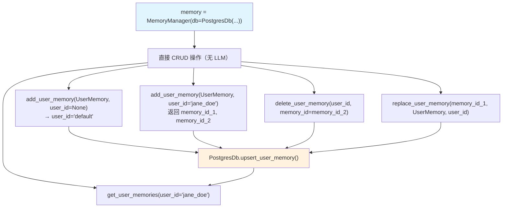

# 01_standalone_memory.py — 实现原理分析

> 源文件：`cookbook/11_memory/memory_manager/01_standalone_memory.py`

## 概述

本示例展示 **`MemoryManager` 的独立 CRUD 用法**：不依赖 Agent，直接使用 `MemoryManager` 实例对用户记忆进行增删改查操作。这是最底层的记忆管理 API，适用于需要程序化管理记忆库的场景。

**核心配置一览：**

| 配置项 | 值 | 说明 |
|--------|------|------|
| `model` | None（未设置） | 仅执行 CRUD，不需要 LLM |
| `db` | `PostgresDb(db_url=...)` | 持久化存储 |
| 操作类型 | add/get/delete/replace | 直接 CRUD，无 AI 推断 |

## 架构分层

```
用户代码层                          MemoryManager 层
┌──────────────────────────────┐   ┌──────────────────────────────────────────────────┐
│ 01_standalone_memory.py      │   │ MemoryManager                                    │
│                              │   │  ├─ add_user_memory(UserMemory)                  │
│ memory = MemoryManager(      │──>│  │    db.upsert_user_memory(memory)              │
│   db=PostgresDb(db_url=...)  │   │  │    return memory_id                           │
│ )                            │   │  ├─ get_user_memories(user_id=...)               │
│                              │   │  │    read_from_db(user_id)                      │
│ memory.add_user_memory(...)  │   │  │    return List[UserMemory]                    │
│ memory.delete_user_memory()  │   │  ├─ delete_user_memory(user_id, memory_id)      │
│ memory.replace_user_memory() │   │  │    db.delete_user_memory(memory_id)           │
│                              │   │  └─ replace_user_memory(memory_id, UserMemory)  │
└──────────────────────────────┘   │       db.upsert_user_memory(memory)              │
                                   └──────────────────────────────────────────────────┘
                                              │
                                              ▼
                                   ┌──────────────────┐
                                   │ PostgresDb        │
                                   │ user_memories 表  │
                                   └──────────────────┘
```

## 核心组件解析

### UserMemory 数据结构

```python
# 创建记忆对象
UserMemory(
    memory="The user's name is John Doe",  # 记忆内容
    topics=["name"],                        # 可选标签（便于检索）
    # user_id 在 add_user_memory() 的 user_id 参数中传入
    # memory_id 由数据库自动生成
)
```

### add_user_memory — 添加记忆

```python
# memory/manager.py L211（简化）
def add_user_memory(self, memory: UserMemory, user_id: Optional[str] = None) -> Optional[str]:
    if user_id is None:
        user_id = "default"
    memory.user_id = user_id
    # 如未设置 memory_id，自动生成
    self.db.upsert_user_memory(memory=memory)
    return memory.memory_id  # 返回 ID，便于后续操作
```

### delete_user_memory — 按 ID 删除

```python
# memory/manager.py L572（简化）
def _delete_db_memory(self, memory_id: str, user_id=None) -> str:
    self.db.delete_user_memory(memory_id=memory_id, user_id=user_id)
    return "Memory deleted successfully"
```

### replace_user_memory — 完全替换

`replace_user_memory()` 是"删除后重建"的快捷操作，保留原 `memory_id` 但替换内容：

```python
# 使用场景：用户信息发生变化时完全替换旧记忆
memory.replace_user_memory(
    memory_id=memory_id_1,
    memory=UserMemory(memory="The user's name is Jane Mary Doe", topics=["name"]),
    user_id=jane_doe_id,
)
```

### 多用户隔离

本例演示了 `user_id` 默认值（`None` → `"default"`）和自定义用户 ID：

```python
# 默认用户（user_id="default"）
memory.add_user_memory(memory=UserMemory(memory="..."))

# 指定用户
memory.add_user_memory(memory=UserMemory(memory="..."), user_id="jane_doe@example.com")

# 只查询指定用户的记忆
memory.get_user_memories(user_id="jane_doe@example.com")
```

## 关键 API 操作流程

| 操作 | 方法 | 返回值 | 说明 |
|------|------|--------|------|
| 添加 | `add_user_memory(memory, user_id)` | `memory_id: str` | 写入 db，返回 ID |
| 查询 | `get_user_memories(user_id)` | `List[UserMemory]` | 读取 db 全部记忆 |
| 删除 | `delete_user_memory(user_id, memory_id)` | None | 按 ID 删除 |
| 替换 | `replace_user_memory(memory_id, memory, user_id)` | None | 完全替换内容 |

## Mermaid 流程图



## 关键源码文件索引

| 文件 | 关键函数/类 | 作用 |
|------|------------|------|
| `agno/memory/manager.py` | `MemoryManager` L44 | 记忆管理器类 |
| `agno/memory/manager.py` | `add_user_memory()` L211 | 添加记忆到 db |
| `agno/memory/manager.py` | `get_user_memories()` L165 | 从 db 读取记忆列表 |
| `agno/memory/manager.py` | `_delete_db_memory()` L572 | 按 ID 删除记忆 |
| `agno/db/base.py` | `UserMemory` | 记忆数据结构 |
