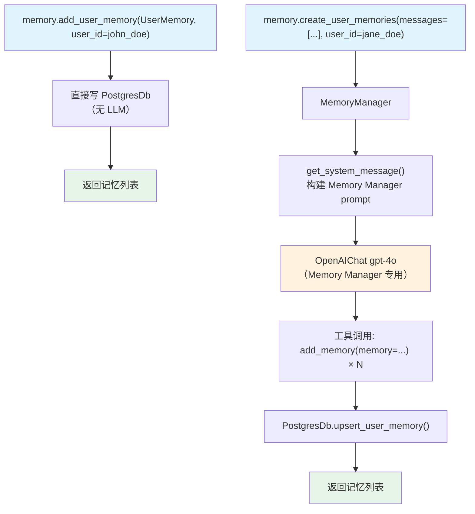

# 02_memory_creation.py — 实现原理分析

> 源文件：`cookbook/11_memory/memory_manager/02_memory_creation.py`

## 概述

本示例展示 **`MemoryManager` 的 AI 驱动记忆创建**：通过 `create_user_memories()` 方法，让 LLM（gpt-4o）分析对话消息并自动提取用户信息生成结构化记忆。支持从单条文本和多条消息列表两种输入方式创建记忆。

**核心配置一览：**

| 配置项 | 值 | 说明 |
|--------|------|------|
| `model` | `OpenAIChat(id="gpt-4o")` | 用于记忆提取分析 |
| `db` | `PostgresDb(memory_db)` | 持久化存储 |
| 创建方式1 | `add_user_memory(UserMemory)` | 手动添加单条记忆 |
| 创建方式2 | `create_user_memories(messages=[...])` | AI 从对话消息提取记忆 |

## 架构分层

```
用户代码层                          MemoryManager 层
┌──────────────────────────────┐   ┌────────────────────────────────────────────────────────┐
│ 02_memory_creation.py        │   │ MemoryManager(model=gpt-4o, db=PostgresDb)             │
│                              │   │  方式1: add_user_memory(UserMemory)                    │
│ 方式1: 手动添加              │──>│    直接写入 db（无 LLM）                                │
│  memory.add_user_memory(     │   │                                                        │
│    UserMemory(memory="...")  │   │  方式2: create_user_memories(messages=[...])           │
│    user_id=john_doe_id,      │   │    ├─ build_memory_task_message() 构造提示             │
│  )                           │   │    │    [existing_memories] + messages                 │
│                              │   │    ├─ get_system_message() → Memory Manager prompt     │
│ 方式2: AI 提取               │   │    ├─ gpt-4o.response(tools=[add/update/del/clear])    │
│  memory.create_user_memories(│   │    └─ 模型调用工具 → db CRUD                           │
│    messages=[Message(...)],  │   └────────────────────────────────────────────────────────┘
│    user_id=jane_doe_id,      │              │
│  )                           │              ▼
└──────────────────────────────┘   ┌──────────────────────┐
                                   │ OpenAIChat gpt-4o    │
                                   │（Memory Manager 专用）│
                                   └──────────────────────┘
```

## 核心组件解析

### create_user_memories — AI 提取记忆

`create_user_memories()`（`memory/manager.py:L368`）调用配置的 LLM 分析消息并调用内置记忆工具：

```python
# memory/manager.py L368（简化）
def create_user_memories(
    self,
    message: Optional[str] = None,       # 单条文本
    messages: Optional[List[Message]] = None,  # 对话历史
    user_id: Optional[str] = None,
    agent_id: Optional[str] = None,
    run_metrics: Optional[RunMetrics] = None,
) -> None:
    # 1. 读取现有记忆
    existing_memories = self.read_from_db(user_id)

    # 2. 构建记忆任务消息
    memory_task_message = build_memory_task_message(message, messages, existing_memories)

    # 3. 调用 LLM（使用 add_memory/update_memory/delete_memory/clear_memory 工具）
    self.run_memory_task(task=memory_task_message, existing_memories=..., user_id=user_id, db=self.db, ...)
```

### get_system_message — MemoryManager 的提示工程

```python
# memory/manager.py L958
# 构建包含以下内容的 system prompt：
# 1. 角色定义："You are a Memory Manager..."
# 2. 记忆标准（memory_capture_instructions）：
#    "Memories should capture personal information about the user..."
# 3. 操作指南：何时添加/更新/删除
# 4. 现有记忆列表：<existing_memories>...</existing_memories>
# 5. 可用工具：add_memory, update_memory, delete_memory（可选 clear_memory）
```

### 两种创建方式对比

| 维度 | `add_user_memory(UserMemory)` | `create_user_memories(messages)` |
|------|------------------------------|----------------------------------|
| 是否调用 LLM | 否 | 是（gpt-4o） |
| 输入 | 结构化 UserMemory 对象 | 原始消息列表 |
| 适用场景 | 程序化写入已知信息 | 从对话自动提取 |
| 控制粒度 | 完全精确 | AI 决策（可能过滤/合并） |

### Message 对象构建

```python
# 从对话历史创建记忆
memory.create_user_memories(
    messages=[
        Message(role="user", content="My name is Jane Doe"),
        Message(role="assistant", content="That is great!"),
        Message(role="user", content="I like to play chess"),
        Message(role="assistant", content="That is great!"),
    ],
    user_id=jane_doe_id,
)
# → gpt-4o 分析对话，提取 "Jane Doe" 和 "plays chess" 创建两条记忆
```

## MemoryManager 内部 API 请求

```python
# create_user_memories() 内部触发的 LLM 请求
client.chat.completions.create(
    model="gpt-4o",
    messages=[
        {"role": "system", "content": "You are a Memory Manager...\n<memories_to_capture>\nMemories should capture personal information...\n</memories_to_capture>\n<existing_memories>（空或已有记忆）</existing_memories>"},
        {"role": "user", "content": "My name is Jane Doe\nI like to play chess"}
    ],
    tools=[
        {"type": "function", "function": {"name": "add_memory", ...}},
        {"type": "function", "function": {"name": "update_memory", ...}},
        {"type": "function", "function": {"name": "delete_memory", ...}}
    ]
)
# 模型决策：调用 add_memory("User's name is Jane Doe") + add_memory("Jane Doe likes to play chess")
```

## Mermaid 流程图



## 关键源码文件索引

| 文件 | 关键函数/类 | 作用 |
|------|------------|------|
| `agno/memory/manager.py` | `create_user_memories()` L368 | AI 驱动记忆创建入口 |
| `agno/memory/manager.py` | `get_system_message()` L958 | 构建 Memory Manager 提示 |
| `agno/memory/manager.py` | `run_memory_task()` | 执行 LLM + 工具调用循环 |
| `agno/models/message.py` | `Message` | 消息对象（role/content） |
