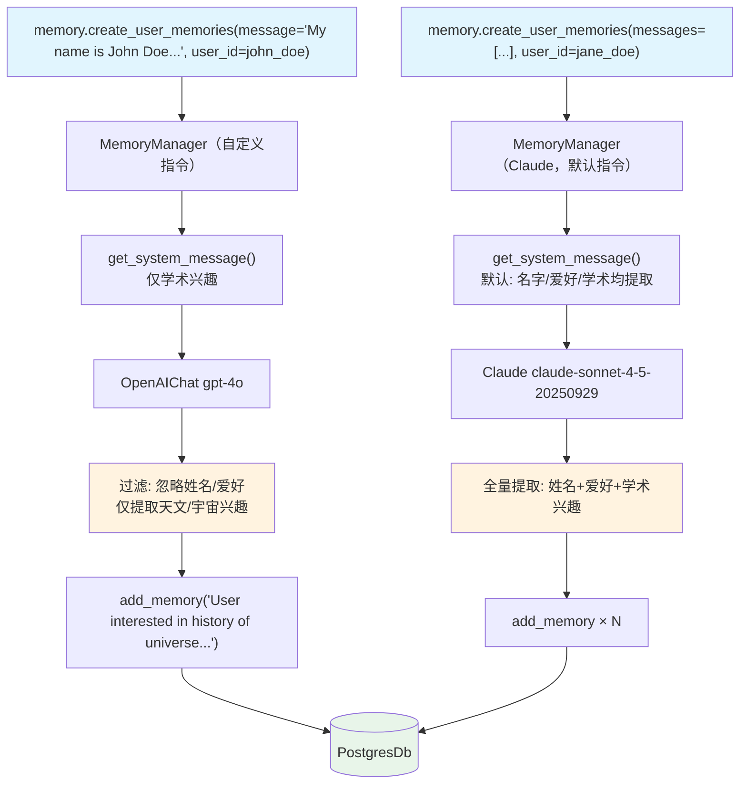

# 03_custom_memory_instructions.py — 实现原理分析

> 源文件：`cookbook/11_memory/memory_manager/03_custom_memory_instructions.py`

## 概述

本示例展示 **`MemoryManager` 的自定义记忆捕获指令**：通过 `memory_capture_instructions` 参数精确控制 LLM 提取记忆的标准，同时对比了两种不同配置的 MemoryManager 行为差异。第一个仅提取学术兴趣（忽略姓名和爱好），第二个使用默认 Claude 模型从长对话中全面提取信息。

**核心配置一览：**

| 配置项 | memory（自定义） | memory（默认，Claude） |
|--------|----------------|----------------------|
| `model` | `OpenAIChat("gpt-4o")` | `Claude("claude-sonnet-4-5-20250929")` |
| `memory_capture_instructions` | 仅学术兴趣 | None（使用默认规则） |
| `db` | `PostgresDb(memory_db)` | 同一个 db |

## 架构分层

```
用户代码层                          MemoryManager 层
┌──────────────────────────────┐   ┌────────────────────────────────────────────────────────┐
│ 03_custom_memory_instructions│   │ memory（自定义指令）                                    │
│                              │   │  get_system_message():                                 │
│ memory = MemoryManager(      │   │    memory_capture_instructions = "仅学术兴趣"           │
│   model=gpt-4o,              │──>│    → 只提取 "astronomy/physics/history of universe"    │
│   memory_capture_instructions│   │    → 忽略 "John Doe"、"hiking"、"cooking"              │
│     = "仅学术兴趣...",         │   │                                                        │
│ )                            │   │ memory（Claude，默认指令）                              │
│                              │   │  get_system_message():                                 │
│ memory.create_user_memories( │   │    memory_capture_instructions = 默认（名字/爱好等）    │
│   message="My name is ...",  │   │    → 提取 "Jane Doe"、"chess/D&D"、"astronomy"         │
│ )                            │   └────────────────────────────────────────────────────────┘
└──────────────────────────────┘
```

## 核心组件解析

### memory_capture_instructions — 过滤记忆提取

`memory_capture_instructions` 替换 `get_system_message()` 中的默认标准（`memory/manager.py:L969`）：

```python
# memory/manager.py L969-978
memory_capture_instructions = self.memory_capture_instructions or dedent(
    """\
    Memories should capture personal information about the user that is relevant to the current conversation, such as:
    - Personal facts: name, age, occupation, location, interests, and preferences
    - Opinions and preferences: what the user likes, dislikes, enjoys, or finds frustrating
    ...
"""
)
```

本例中自定义为：

```python
memory_capture_instructions = """\
Memories should only include details about the user's academic interests.
Only include which subjects they are interested in.
Ignore names, hobbies, and personal interests.
"""
```

### 对比结果

输入："My name is John Doe. I enjoy hiking... I am interested to learn about the history of the universe..."

| MemoryManager | 提取结果 |
|---------------|---------|
| 自定义（仅学术） | "User is interested in the history of the universe and astronomical topics." |
| 默认（Claude） | "User's name is Jane Doe", "Jane Doe likes chess", "Jane Doe interested in D&D", "Jane Doe interested in astronomy/physics" 等多条 |

### 支持多种模型

本例演示了 `MemoryManager` 支持任意 Agno 兼容模型，不仅限于 OpenAI：

```python
# Claude 模型
memory = MemoryManager(model=Claude(id="claude-sonnet-4-5-20250929"), db=memory_db)
memory.create_user_memories(messages=[...], user_id=jane_doe_id)
```

## MemoryManager System Prompt（自定义版）

```text
You are a Memory Manager that is responsible for managing information and preferences about the user.
...

<memories_to_capture>
Memories should only include details about the user's academic interests.
Only include which subjects they are interested in.
Ignore names, hobbies, and personal interests.
</memories_to_capture>

## Updating memories
  - Decide to make no changes.
  - Decide to add a new memory, using the `add_memory` tool.
  - Decide to update an existing memory, using the `update_memory` tool.
  - Decide to delete an existing memory, using the `delete_memory` tool.
...
```

## Mermaid 流程图



## 关键源码文件索引

| 文件 | 关键函数/类 | 作用 |
|------|------------|------|
| `agno/memory/manager.py` | `memory_capture_instructions` L54 | 自定义记忆捕获标准字段 |
| `agno/memory/manager.py` | `get_system_message()` L958 | 构建含自定义标准的提示 |
| `agno/models/anthropic/claude.py` | `Claude` | Anthropic Claude 模型适配 |
