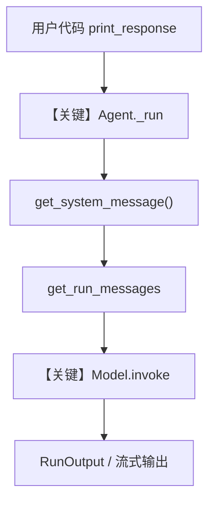

# 03_custom_memory_instructions.py — 实现原理分析

<!-- cookbook-py-source:start -->
## 完整源码

```python
"""
Custom Memory Capture Instructions
==================================

This example shows how to customize memory capture instructions and compare the
results with a default memory manager.
"""

from agno.db.postgres import PostgresDb
from agno.memory import MemoryManager
from agno.models.anthropic.claude import Claude
from agno.models.message import Message
from agno.models.openai import OpenAIChat
from rich.pretty import pprint

# ---------------------------------------------------------------------------
# Setup
# ---------------------------------------------------------------------------
db_url = "postgresql+psycopg://ai:ai@localhost:5532/ai"
memory_db = PostgresDb(db_url=db_url)

# ---------------------------------------------------------------------------
# Create Memory Managers
# ---------------------------------------------------------------------------
memory = MemoryManager(
    model=OpenAIChat(id="gpt-4o"),
    memory_capture_instructions="""\
                    Memories should only include details about the user's academic interests.
                    Only include which subjects they are interested in.
                    Ignore names, hobbies, and personal interests.
                    """,
    db=memory_db,
)

# ---------------------------------------------------------------------------
# Run Memory Manager
# ---------------------------------------------------------------------------
if __name__ == "__main__":
    john_doe_id = "john_doe@example.com"
    memory.create_user_memories(
        message="""\
My name is John Doe.

I enjoy hiking in the mountains on weekends,
reading science fiction novels before bed,
cooking new recipes from different cultures,
playing chess with friends.

I am interested to learn about the history of the universe and other astronomical topics.
""",
        user_id=john_doe_id,
    )

    memories = memory.get_user_memories(user_id=john_doe_id)
    print("John Doe's memories:")
    pprint(memories)

    memory = MemoryManager(model=Claude(id="claude-sonnet-4-5-20250929"), db=memory_db)
    jane_doe_id = "jane_doe@example.com"

    memory.create_user_memories(
        messages=[
            Message(role="user", content="Hi, how are you?"),
            Message(role="assistant", content="I'm good, thank you!"),
            Message(role="user", content="What are you capable of?"),
            Message(
                role="assistant",
                content="I can help you with your homework and answer questions about the universe.",
            ),
            Message(role="user", content="My name is Jane Doe"),
            Message(role="user", content="I like to play chess"),
            Message(
                role="user",
                content="Actually, forget that I like to play chess. I more enjoy playing table top games like dungeons and dragons",
            ),
            Message(
                role="user",
                content="I'm also interested in learning about the history of the universe and other astronomical topics.",
            ),
            Message(role="assistant", content="That is great!"),
            Message(
                role="user",
                content="I am really interested in physics. Tell me about quantum mechanics?",
            ),
        ],
        user_id=jane_doe_id,
    )

    memories = memory.get_user_memories(user_id=jane_doe_id)
    print("Jane Doe's memories:")
    pprint(memories)
```

<!-- cookbook-py-source:end -->

> 源文件：`cookbook/11_memory/memory_manager/03_custom_memory_instructions.py`

## 概述

本示例展示 Agno 的 **Agent 基础运行** 机制：通过 `Agent` 配置模型与可选推理链路，完成示例任务。
**核心配置一览（首个/主要 Agent）：**

| 配置项 | 值 | 说明 |
|--------|------|------|
| （解析） | — | 未能解析 Agent 构造，请直接参阅源码 |
| `db` | `None` | 未设置 |
| `knowledge` | `None` | 未设置 |
| `tools` | `None` | 未设置 |
| `instructions` | `None` | 未设置 |
| `description` | `None` | 未设置 |
| `system_message` | `None` | 未设置 |

## 架构分层

```
用户代码层                agno.agent 层
┌──────────────────┐    ┌──────────────────────────────────┐
│ 03_custom_memory_i│    │ Agent._run / _arun               │
│ Agent(...)       │───>│  get_system_message()            │
│ print_response   │    │  get_run_messages()              │
└──────────────────┘    │  handle_reasoning（若启用）       │
                        └──────────────────────────────────┘
                                │
                                ▼
                        ┌──────────────┐
                        │ Model.invoke │
                        └──────────────┘
```

## 核心组件解析

### Agent 与推理

当 `reasoning=True` 或配置了 `reasoning_model` 时，`_run` 在适当时机调用 `handle_reasoning` / `handle_reasoning_stream`（`agno/agent/_response.py` L72+），内部进入 `reason()` 生成推理内容。

### 运行机制与因果链

1. **路径**：`Agent.run` / `print_response` → `get_system_message` → `get_run_messages` → 模型；推理启用时插入推理阶段。
2. **状态**：默认不写 session/db；若配置 `db`、`update_memory_on_run` 等则会持久化（见各文件）。
3. **分支**：仅主模型 vs `reasoning_model`、流式 `stream=True`、`show_full_reasoning` 影响输出展示。
4. **定位**：位于 `cookbook` 的 **Memory 记忆** 主题，对照同目录示例可看出参数差异。

## System Prompt 组装

| 序号 | 组成部分 | 本文件中的值/来源 | 是否生效 |
|------|---------|-----------------|---------|
| 1 | `description` | 未设置 | 否 |
| 2 | `role` | 未设置 | 否 |
| 3 | `instructions` | 未设置 | 否 |
| 4.1 | `markdown` | False | 否 |

### 拼装顺序与源码锚点

默认：`# 1` 自定义 `system_message` 早退 → 否则 `# 2` build_context → `# 3.1` instructions → `# 3.2.1` markdown 附加段 → `# 3.3.1-3.3.4` description/role/instructions 拼接…（`agno/agent/_messages.py`）。

### 还原后的完整 System 文本

```text
（以下为 `get_system_message()` 默认路径下、仅启用 markdown 附加段时的典型结构；本示例未设置 instructions/description。）

<additional_information>
- Use markdown to format your answers.
</additional_information>
```

### 段落释义（模型视角）

- `instructions`：直接约束角色与解题步骤（若存在）。
- `markdown`：附加格式化要求，减少非结构化输出。
- 无业务 instructions 时，模型仅受默认附加段约束，行为更依赖用户消息。

### 与 User / Developer 消息的边界

用户任务来自 `print_response`/`run` 的输入字符串；OpenAI Chat 适配器使用 `messages` 列表中的 `system`/`user`/`assistant` 角色。

## 完整 API 请求

```python
# OpenAIChat（常见）：
# client.chat.completions.create(
#     model=<id>,
#     messages=[...],  # system + user + ...
#     **get_request_params(...),
# )
# 见 agno/models/openai/chat.py invoke() L385+
```

> 其他厂商请对照对应 `Model` 子类的 `invoke`/`ainvoke`。

## Mermaid 流程图


```mermaid
flowchart TD
    A["用户代码 print_response"] --> B["【关键】Agent._run"]
    B --> C["get_system_message()"]
    C --> D["get_run_messages"]
    D --> E["【关键】Model.invoke"]
    E --> F["RunOutput / 流式输出"]
```

- **【关键】Agent._run**：单次运行的调度与消息组装入口。
- **【关键】Model.invoke**：实际调用模型适配器（厂商相关）。

## 关键源码文件索引

| 文件 | 关键函数/类 | 作用 |
|------|------------|------|
| `agno/agent/agent.py` | `get_system_message` L799+ | 委托 `_messages` |
| `agno/agent/_messages.py` | `get_system_message()` L106+ | system 拼装 |
| `agno/agent/_response.py` | `handle_reasoning()` L72+ | 推理处理 |
| `agno/agent/_run.py` | run 主循环 | 调用推理与模型 |
| `agno/models/openai/chat.py` | `invoke()` L385+ | Chat Completions |
