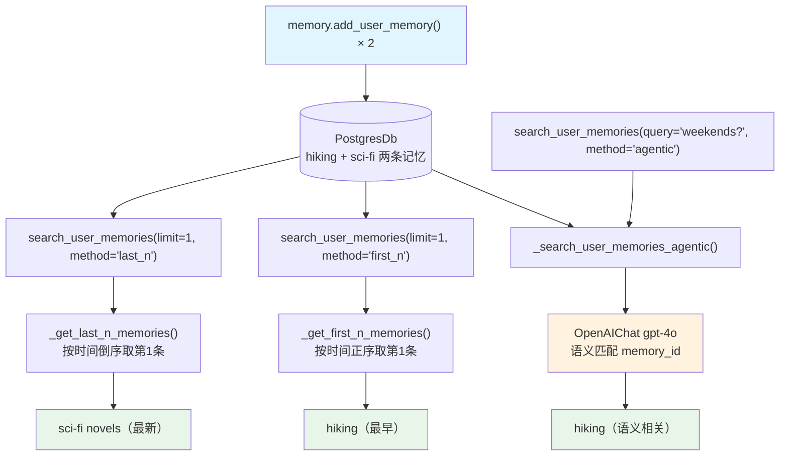

# 04_memory_search.py — 实现原理分析

> 源文件：`cookbook/11_memory/memory_manager/04_memory_search.py`

## 概述

本示例展示 **`MemoryManager.search_user_memories()` 的三种检索模式**：`last_n`（最新 N 条）、`first_n`（最早 N 条）、`agentic`（AI 语义检索）。三种模式满足不同的记忆检索需求，agentic 模式通过 LLM 智能匹配与查询相关的记忆。

**核心配置一览：**

| 配置项 | 值 | 说明 |
|--------|------|------|
| `model` | `OpenAIChat(id="gpt-4o")` | 用于 agentic 语义检索 |
| `db` | `PostgresDb(memory_db)` | 持久化存储 |
| 检索模式 | `last_n` / `first_n` / `agentic` | 三种不同检索策略 |

## 架构分层

```
用户代码层                          MemoryManager 层
┌──────────────────────────────┐   ┌──────────────────────────────────────────────────────────────┐
│ 04_memory_search.py          │   │ search_user_memories(query, limit, retrieval_method, user_id) │
│                              │   │  ├─ "last_n"  → _get_last_n_memories()                       │
│ memory.add_user_memory(...)  │   │  │    memories[-limit:]（按 created_at 排序后取最新）          │
│ memory.search_user_memories( │──>│  ├─ "first_n" → _get_first_n_memories()                      │
│   retrieval_method="last_n", │   │  │    memories[:limit]（最早的 N 条）                         │
│   limit=1,                   │   │  └─ "agentic" → _search_user_memories_agentic()              │
│ )                            │   │       gpt-4o 语义分析 → 返回相关 memory_id 列表              │
└──────────────────────────────┘   └──────────────────────────────────────────────────────────────┘
                                              │
                                   ┌──────────┴──────────────┐
                                   │ OpenAIChat gpt-4o        │
                                   │（仅 agentic 模式使用）    │
                                   └──────────────────────────┘
```

## 核心组件解析

### search_user_memories — 三种检索模式

```python
# memory/manager.py L588
def search_user_memories(
    self,
    query: Optional[str] = None,
    limit: Optional[int] = None,
    retrieval_method: Optional[Literal["last_n", "first_n", "agentic"]] = None,
    user_id: Optional[str] = None,
) -> List[UserMemory]:
    memories = self.read_from_db(user_id=user_id)

    if retrieval_method == "agentic":
        return self._search_user_memories_agentic(user_id, query, limit)
    elif retrieval_method == "first_n":
        return self._get_first_n_memories(user_id, limit)
    else:  # 默认 last_n
        return self._get_last_n_memories(user_id, limit)
```

### agentic 检索 — LLM 语义匹配

`_search_user_memories_agentic()`（`memory/manager.py:L656`）构建包含所有记忆的提示，让 LLM 返回与查询相关的 memory_id：

```python
# memory/manager.py L673-693（简化）
system_message_str = "Your task is to search through user memories and return the IDs of the memories that are related to the query.\n"
system_message_str += "\n<user_memories>\n"
for memory in user_memories:
    system_message_str += f"ID: {memory.memory_id}\n"
    system_message_str += f"Memory: {memory.memory}\n"
    if memory.topics:
        system_message_str += f"Topics: {','.join(memory.topics)}\n"
# ...发送给 gpt-4o，返回 MemorySearchResponse（含相关 memory_id 列表）
```

### 三种模式对比

| 模式 | 是否调用 LLM | 输入 | 适用场景 |
|------|-------------|------|---------|
| `last_n` | 否 | `limit` | 获取最近的 N 条记忆（时间顺序） |
| `first_n` | 否 | `limit` | 获取最早的 N 条记忆 |
| `agentic` | 是（gpt-4o） | `query` | 语义相关性检索（"哪些记忆关于周末？"） |

### 实际使用示例

```python
# 添加两条记忆
memory.add_user_memory(UserMemory(memory="The user enjoys hiking on weekends"), user_id=john_doe_id)
memory.add_user_memory(UserMemory(memory="The user enjoys reading sci-fi novels"), user_id=john_doe_id)

# last_n: 获取最新 1 条 → "sci-fi novels"
memories = memory.search_user_memories(user_id=john_doe_id, limit=1, retrieval_method="last_n")

# first_n: 获取最早 1 条 → "hiking"
memories = memory.search_user_memories(user_id=john_doe_id, limit=1, retrieval_method="first_n")

# agentic: 语义检索 → "hiking"（与"周末活动"最相关）
memories = memory.search_user_memories(
    user_id=john_doe_id,
    query="What does the user like to do on weekends?",
    retrieval_method="agentic",
)
```

## agentic 模式内部 API 请求

```python
# _search_user_memories_agentic() 内部触发
client.chat.completions.create(
    model="gpt-4o",
    messages=[
        {"role": "system", "content": "Your task is to search through user memories and return the IDs...\n<user_memories>\nID: uuid-1\nMemory: The user enjoys hiking in the mountains on weekends\nTopics: outdoor\n\nID: uuid-2\nMemory: The user enjoys reading science fiction novels before bed\nTopics: reading\n</user_memories>"},
        {"role": "user", "content": "Query: What does the user like to do on weekends?"}
    ],
    response_format=MemorySearchResponse  # 结构化输出
)
# 模型返回: {"memory_ids": ["uuid-1"]}
```

## Mermaid 流程图



## 关键源码文件索引

| 文件 | 关键函数/类 | 作用 |
|------|------------|------|
| `agno/memory/manager.py` | `search_user_memories()` L588 | 检索入口，分发三种模式 |
| `agno/memory/manager.py` | `_search_user_memories_agentic()` L656 | LLM 语义检索实现 |
| `agno/memory/manager.py` | `_get_last_n_memories()` | 按时间取最新 N 条 |
| `agno/memory/manager.py` | `_get_first_n_memories()` | 按时间取最早 N 条 |
