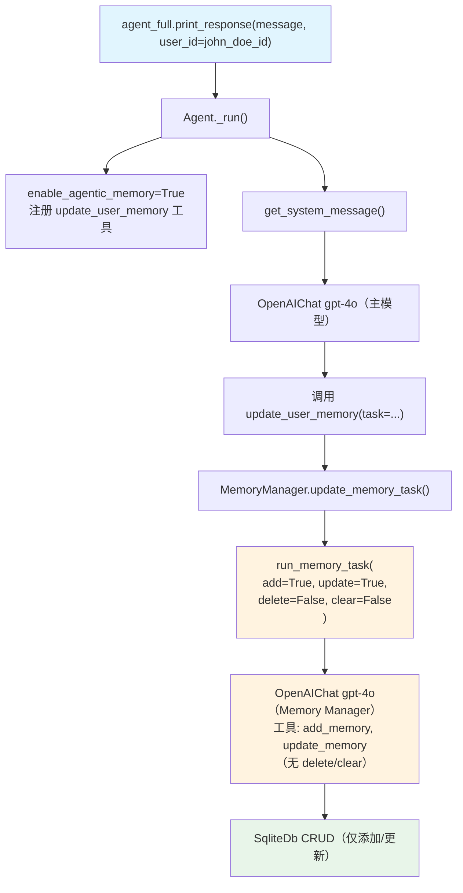

# 05_db_tools_control.py — 实现原理分析

> 源文件：`cookbook/11_memory/memory_manager/05_db_tools_control.py`

## 概述

本示例展示 **`MemoryManager` 数据库工具权限控制** 机制：通过 `add_memories`、`update_memories`、`delete_memories`、`clear_memories` 四个布尔标志，精确控制 LLM 可以执行哪些记忆 CRUD 操作。本例仅开放添加和更新权限（禁止删除和清空），防止误操作。

**核心配置一览：**

| 配置项 | memory_manager_full | 说明 |
|--------|---------------------|------|
| `model` | `OpenAIChat("gpt-4o")` | 记忆分析模型 |
| `db` | `SqliteDb("tmp/memory_control_demo.db")` | 本地存储 |
| `add_memories` | `True` | 允许添加记忆 |
| `update_memories` | `True` | 允许更新记忆 |
| `delete_memories` | `False`（默认） | 禁止删除记忆 |
| `clear_memories` | `False`（默认） | 禁止清空记忆 |
| Agent `enable_agentic_memory` | `True` | 使用 update_user_memory 工具 |

## 架构分层

```
用户代码层                              MemoryManager 层
┌──────────────────────────────────┐   ┌────────────────────────────────────────────────┐
│ 05_db_tools_control.py           │   │ MemoryManager(add=True, update=True,            │
│                                  │   │               delete=False, clear=False)         │
│ memory_manager_full = MemoryManager(│ │                                                │
│   add_memories=True,             │──>│  update_memory_task(task) 被调用时:             │
│   update_memories=True,          │   │    run_memory_task(                             │
│ )                                │   │      delete_memories=False,  ← 不传 delete 工具 │
│ agent_full = Agent(              │   │      clear_memories=False,   ← 不传 clear 工具  │
│   memory_manager=memory_manager, │   │      add_memories=True,      ← 传 add_memory 工具│
│   enable_agentic_memory=True,    │   │      update_memories=True,   ← 传 update 工具   │
│ )                                │   │    )                                             │
└──────────────────────────────────┘   └────────────────────────────────────────────────┘
```

## 核心组件解析

### 工具权限控制机制

`MemoryManager.determine_tools_for_model()`（`memory/manager.py:L938`）根据布尔标志决定注册哪些工具：

```python
# memory/manager.py L938（简化）
def determine_tools_for_model(
    self,
    enable_delete_memory: bool = True,
    enable_clear_memory: bool = True,
    enable_update_memory: bool = True,
    enable_add_memory: bool = True,
) -> List[Function]:
    tools = []
    if enable_add_memory:
        tools.append(self._upsert_db_memory)  # add_memory 工具
    if enable_update_memory:
        tools.append(self._update_db_memory)  # update_memory 工具
    if enable_delete_memory:
        tools.append(self._delete_db_memory)  # delete_memory 工具
    if enable_clear_memory:
        tools.append(self._clear_db_memories)  # clear_memory 工具
    return tools
```

`update_memory_task()` 将 `MemoryManager` 的配置标志传递给 `run_memory_task()`：

```python
# memory/manager.py L503-512
response = self.run_memory_task(
    task=task,
    existing_memories=existing_memories,
    user_id=user_id,
    db=self.db,
    delete_memories=self.delete_memories,  # False → 不注册 delete 工具
    update_memories=self.update_memories,  # True → 注册 update 工具
    add_memories=self.add_memories,        # True → 注册 add 工具
    clear_memories=self.clear_memories,    # False → 不注册 clear 工具
)
```

### System Prompt 中工具列表动态调整

`get_system_message()`（`memory/manager.py:L1013-1017`）根据标志动态添加工具说明行：

```python
if enable_add_memory:
    system_prompt_lines.append("  - Decide to add a new memory, using the `add_memory` tool.")
if enable_update_memory:
    system_prompt_lines.append("  - Decide to update an existing memory, using the `update_memory` tool.")
if enable_delete_memory:
    system_prompt_lines.append("  - Decide to delete an existing memory, using the `delete_memory` tool.")
if enable_clear_memory:
    system_prompt_lines.append("  - Decide to clear all memories, using the `clear_memory` tool.")
```

本例中：LLM 只会看到 `add_memory` 和 `update_memory` 的说明，无法使用 delete/clear。

### 完整生命周期演示

```python
# 步骤1：告知信息 → 记忆中添加 hiking + photography
agent_full.print_response("I like to hike... I also enjoy photography.", user_id=john_doe_id)
# → update_user_memory("Add: user likes hiking, user enjoys photography")
# → MemoryManager: add_memory(hiking), add_memory(photography)

# 步骤2：询问爱好 → 读取记忆回答
agent_full.print_response("What are my hobbies?", user_id=john_doe_id)

# 步骤3：更新爱好 → 更新记忆（photography → rock climbing）
agent_full.print_response("I no longer enjoy photography. Instead, I've taken up rock climbing.", user_id=john_doe_id)
# → update_user_memory("Update photography memory to rock climbing")
# → MemoryManager: update_memory(id=photography_id, "User took up rock climbing")
```

## MemoryManager System Prompt（权限控制版）

```text
You are a Memory Manager...

## Updating memories
You will also be provided with a list of existing memories in the <existing_memories> section. You can:
  - Decide to make no changes.
  - Decide to add a new memory, using the `add_memory` tool.
  - Decide to update an existing memory, using the `update_memory` tool.
  （注意：无 delete_memory 和 clear_memory 说明）
```

## 完整 API 请求

```python
# agent_full 主对话（带 update_user_memory 工具）
client.chat.completions.create(
    model="gpt-4o",
    messages=[
        {"role": "system", "content": "You have the capability to retain memories...\n<updating_user_memories>..."},
        {"role": "user", "content": "My name is John Doe and I like to hike... I also enjoy photography."}
    ],
    tools=[{"type": "function", "function": {"name": "update_user_memory", ...}}]
)

# 模型调用 update_user_memory，触发内部 MemoryManager 请求（仅 add/update 工具）
client.chat.completions.create(
    model="gpt-4o",
    messages=[
        {"role": "system", "content": "You are a Memory Manager...\n  - Decide to add a new memory, using the `add_memory` tool.\n  - Decide to update an existing memory, using the `update_memory` tool."},
        {"role": "user", "content": "Add: user likes hiking and photography"}
    ],
    tools=[
        {"type": "function", "function": {"name": "add_memory", ...}},
        {"type": "function", "function": {"name": "update_memory", ...}}
        # 注意：没有 delete_memory 和 clear_memory
    ]
)
```

## Mermaid 流程图



## 关键源码文件索引

| 文件 | 关键函数/类 | 作用 |
|------|------------|------|
| `agno/memory/manager.py` | `MemoryManager.__init__()` L76 | 接受权限控制标志 |
| `agno/memory/manager.py` | `determine_tools_for_model()` L938 | 按标志注册工具 |
| `agno/memory/manager.py` | `update_memory_task()` L481 | 传递标志给 run_memory_task |
| `agno/memory/manager.py` | `get_system_message()` L1013-1017 | 动态生成工具说明 |
