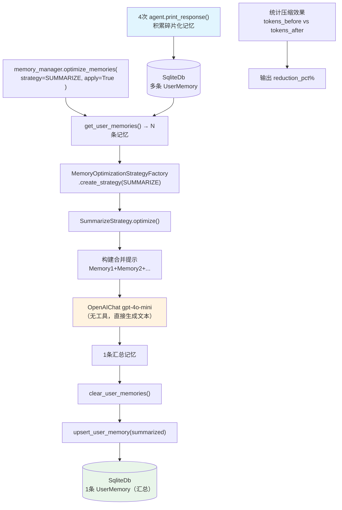

# 01_memory_summarize_strategy.py — 实现原理分析

> 源文件：`cookbook/11_memory/optimize_memories/01_memory_summarize_strategy.py`

## 概述

本示例展示 **`MemoryManager.optimize_memories()` 的汇总策略（`SummarizeStrategy`）**：将多条碎片化记忆合并为一条综合摘要，通过 LLM 消除冗余并压缩 token 数量。这是 Agno 内置的记忆优化机制，适用于长期用户对话后记忆条目过多的场景。

**核心配置一览：**

| 配置项 | 值 | 说明 |
|--------|------|------|
| Agent `model` | `OpenAIChat("gpt-4o-mini")` | 主对话模型 |
| Agent `update_memory_on_run` | `True` | 每次运行后提取记忆 |
| MemoryManager `model` | `OpenAIChat("gpt-4o-mini")` | 记忆提取 + 优化模型 |
| `strategy` | `MemoryOptimizationStrategyType.SUMMARIZE` | 汇总策略（枚举类型） |
| `apply` | `True` | 优化后直接写回 db |
| `db` | `SqliteDb("tmp/memory_summarize_strategy.db")` | 本地存储 |

## 架构分层

```
用户代码层                              记忆优化层
┌──────────────────────────────────┐   ┌────────────────────────────────────────────────────────┐
│ 01_memory_summarize_strategy.py  │   │ memory_manager.optimize_memories(                      │
│                                  │   │   user_id, strategy=SUMMARIZE, apply=True)              │
│ 4次 agent.print_response(...)    │   │  ├─ get_user_memories() → List[UserMemory]（4+条）      │
│ → 积累多条碎片化记忆              │──>│  ├─ MemoryOptimizationStrategyFactory.create_strategy() │
│                                  │   │  │    → SummarizeStrategy()                            │
│ memory_manager.optimize_memories(│   │  ├─ strategy.optimize(memories, model=gpt-4o-mini)     │
│   user_id=user_id,               │   │  │    → 调用 LLM 合并为 1 条摘要                       │
│   strategy=SUMMARIZE,            │   │  ├─ clear_user_memories(user_id)                       │
│   apply=True,                    │   │  └─ db.upsert_user_memory(summarized)                   │
│ )                                │   └────────────────────────────────────────────────────────┘
└──────────────────────────────────┘              │
                                       ┌──────────┴──────────────┐
                                       │ OpenAIChat gpt-4o-mini   │
                                       │（SummarizeStrategy 专用） │
                                       └──────────────────────────┘
```

## 核心组件解析

### optimize_memories — 优化入口

`MemoryManager.optimize_memories()`（`memory/manager.py:L793`）：

```python
# memory/manager.py L793-862
def optimize_memories(
    self,
    user_id=None,
    strategy: Union[MemoryOptimizationStrategyType, MemoryOptimizationStrategy] = SUMMARIZE,
    apply: bool = True,
) -> List[UserMemory]:
    # 1. 获取当前所有记忆
    memories = self.get_user_memories(user_id=user_id)

    # 2. 获取策略实例
    if isinstance(strategy, MemoryOptimizationStrategyType):
        strategy_instance = MemoryOptimizationStrategyFactory.create_strategy(strategy)
    else:
        strategy_instance = strategy  # 自定义策略实例

    # 3. 执行优化
    optimization_model = self.get_model()
    optimized_memories = strategy_instance.optimize(memories=memories, model=optimization_model)

    # 4. 写回 db（如 apply=True）
    if apply:
        self.clear_user_memories(user_id=user_id)  # 清除旧记忆
        for opt_mem in optimized_memories:
            self.db.upsert_user_memory(memory=opt_mem)  # 写入新记忆

    return optimized_memories
```

### SummarizeStrategy.optimize — LLM 合并记忆

```python
# memory/strategies/summarize.py L44-119
def optimize(self, memories: List[UserMemory], model: Model) -> List[UserMemory]:
    # 1. 提取所有记忆文本
    combined_content = "\n\n".join([f"Memory {i+1}: {mem.memory}" for i, mem in enumerate(memories)])

    # 2. 构建 LLM 消息
    messages_for_model = [
        Message(role="system", content=system_prompt),  # "You are a memory compression assistant..."
        Message(role="user", content=f"Summarize these memories:\n\n{combined_content}"),
    ]

    # 3. 调用 LLM
    response = model.response(messages=messages_for_model)

    # 4. 创建单条汇总记忆（保留 topics 合集、user_id）
    summarized_memory = UserMemory(
        memory_id=str(uuid4()),
        memory=response.content.strip(),
        topics=list(set(all_topics)),  # 合并所有 topics
        user_id=memories[0].user_id,
        ...
    )
    return [summarized_memory]  # 返回单条记忆
```

### count_tokens — 压缩率统计

`MemoryOptimizationStrategy.count_tokens()`（`strategies/base.py:L58`）使用 token 计数函数衡量压缩效果：

```python
def count_tokens(self, memories: List[UserMemory]) -> int:
    return sum(count_text_tokens(m.memory or "") for m in memories)
```

本例在优化前后各调用一次，计算 token 节省率：
```python
tokens_before = strategy.count_tokens(memories_before)
# 优化后
tokens_after = strategy.count_tokens(memories_after)
reduction_pct = ((tokens_before - tokens_after) / tokens_before) * 100
```

### MemoryOptimizationStrategyType 枚举

```python
# memory/strategies/types.py L8
class MemoryOptimizationStrategyType(str, Enum):
    SUMMARIZE = "summarize"
    # 未来可扩展更多策略类型
```

通过工厂模式创建策略实例，支持传 enum 或自定义策略对象。

## SummarizeStrategy System Prompt

```text
You are a memory compression assistant. Your task is to summarize multiple memories about a user
into a single comprehensive summary while preserving all key facts.

Requirements:
- Combine related information from all memories
- Preserve all factual information
- Remove redundancy and consolidate repeated facts
- Create a coherent narrative about the user
- Maintain third-person perspective
- Do not add information not present in the original memories

Return only the summarized memory text, nothing else.
```

## 内部 LLM 请求（SummarizeStrategy）

```python
client.chat.completions.create(
    model="gpt-4o-mini",
    messages=[
        {"role": "system", "content": "You are a memory compression assistant..."},
        {"role": "user", "content": """Summarize these memories into a single summary:

Memory 1: User has a golden retriever named Max who is 3 years old...
Memory 2: User lives in San Francisco, works in tech as a product manager...
Memory 3: User enjoys hiking in Bay Area and trying new restaurants...
Memory 4: User has been learning piano for 1.5 years...
"""}
    ]
    # 无 tools，直接返回文本
)
# 返回：单条综合摘要文本
```

## Mermaid 流程图



## 关键源码文件索引

| 文件 | 关键函数/类 | 作用 |
|------|------------|------|
| `agno/memory/manager.py` | `optimize_memories()` L793 | 优化入口（获取→策略→写回） |
| `agno/memory/strategies/summarize.py` | `SummarizeStrategy` L15 | 汇总策略实现 |
| `agno/memory/strategies/summarize.py` | `optimize()` L44 | 调用 LLM 合并记忆 |
| `agno/memory/strategies/base.py` | `MemoryOptimizationStrategy` L9 | 策略抽象基类 |
| `agno/memory/strategies/base.py` | `count_tokens()` L58 | Token 计数工具 |
| `agno/memory/strategies/types.py` | `MemoryOptimizationStrategyType` L8 | 内置策略枚举 |
