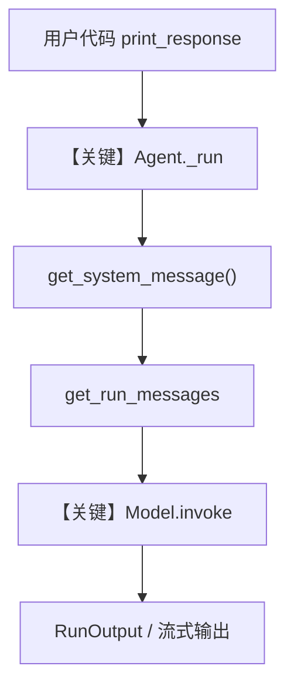

# 01_memory_summarize_strategy.py — 实现原理分析

<!-- cookbook-py-source:start -->
## 完整源码

```python
"""
Optimize Memories With Summarize Strategy
=========================================

This example demonstrates memory optimization using the summarize strategy,
which combines all memories into one summary for token reduction.
"""

from agno.agent import Agent
from agno.db.sqlite import SqliteDb
from agno.memory import MemoryManager, SummarizeStrategy
from agno.memory.strategies.types import MemoryOptimizationStrategyType
from agno.models.openai import OpenAIChat

# ---------------------------------------------------------------------------
# Setup
# ---------------------------------------------------------------------------
db_file = "tmp/memory_summarize_strategy.db"
db = SqliteDb(db_file=db_file)
user_id = "user2"

# ---------------------------------------------------------------------------
# Create Agent and Memory Manager
# ---------------------------------------------------------------------------
agent = Agent(
    model=OpenAIChat(id="gpt-4o-mini"),
    db=db,
    update_memory_on_run=True,
)

memory_manager = MemoryManager(
    model=OpenAIChat(id="gpt-4o-mini"),
    db=db,
)

# ---------------------------------------------------------------------------
# Run Optimization
# ---------------------------------------------------------------------------
if __name__ == "__main__":
    print("Creating memories...")
    agent.print_response(
        "I have a wonderful pet dog named Max who is 3 years old. He's a golden retriever and he's such a friendly and energetic dog. "
        "We got him as a puppy when he was just 8 weeks old. He loves playing fetch in the park and going on long walks. "
        "Max is really smart too - he knows about 15 different commands and tricks. Taking care of him has been one of the most "
        "rewarding experiences of my life. He's basically part of the family now.",
        user_id=user_id,
    )
    agent.print_response(
        "I currently live in San Francisco, which is an amazing city despite all its challenges. I've been here for about 5 years now. "
        "I work in the tech industry as a product manager at a mid-sized software company. The tech scene here is incredible - "
        "there are so many smart people working on interesting problems. The cost of living is definitely high, but the opportunities "
        "and the community make it worthwhile. I live in the Mission district which has great food and a vibrant culture.",
        user_id=user_id,
    )
    agent.print_response(
        "On weekends, I really enjoy hiking in the beautiful areas around the Bay Area. There are so many amazing trails - "
        "from Mount Tamalpais to Big Basin Redwoods. I usually go hiking with a group of friends and we try to explore new trails every month. "
        "I also love trying new restaurants. San Francisco has such an incredible food scene with cuisines from all over the world. "
        "I'm always on the lookout for hidden gems and new places to try. My favorite types of cuisine are Japanese, Thai, and Mexican.",
        user_id=user_id,
    )
    agent.print_response(
        "I've been learning to play the piano for about a year and a half now. It's something I always wanted to do but never had time for. "
        "I finally decided to commit to it and I practice almost every day, usually for 30-45 minutes. "
        "I'm working through classical pieces right now - I can play some simple Bach and Mozart compositions. "
        "My goal is to eventually be able to play some jazz piano as well. Having a creative hobby like this has been great for my mental health "
        "and it's nice to have something completely different from my day job.",
        user_id=user_id,
    )

    print("\nBefore optimization:")
    memories_before = agent.get_user_memories(user_id=user_id)
    print(f"  Memory count: {len(memories_before)}")

    strategy = SummarizeStrategy()
    tokens_before = strategy.count_tokens(memories_before)
    print(f"  Token count: {tokens_before} tokens")

    print("\nIndividual memories:")
    for i, memory in enumerate(memories_before, 1):
        print(f"  {i}. {memory.memory}")

    print("\nOptimizing memories with 'summarize' strategy...")
    memory_manager.optimize_memories(
        user_id=user_id,
        strategy=MemoryOptimizationStrategyType.SUMMARIZE,
        apply=True,
    )

    print("\nAfter optimization:")
    memories_after = agent.get_user_memories(user_id=user_id)
    print(f"  Memory count: {len(memories_after)}")

    tokens_after = strategy.count_tokens(memories_after)
    print(f"  Token count: {tokens_after} tokens")

    if tokens_before > 0:
        reduction_pct = ((tokens_before - tokens_after) / tokens_before) * 100
        tokens_saved = tokens_before - tokens_after
        print(f"  Reduction: {reduction_pct:.1f}% ({tokens_saved} tokens saved)")

    if memories_after:
        print("\nSummarized memory:")
        print(f"  {memories_after[0].memory}")
    else:
        print("\n No memories found after optimization")
```

<!-- cookbook-py-source:end -->

> 源文件：`cookbook/11_memory/optimize_memories/01_memory_summarize_strategy.py`

## 概述

本示例展示 Agno 的 **Agent 基础运行** 机制：通过 `Agent` 配置模型与可选推理链路，完成示例任务。
**核心配置一览（首个/主要 Agent）：**

| 配置项 | 值 | 说明 |
|--------|------|------|
| `db` | `db` | 显式参数 |
| `model` | `OpenAIChat(id='gpt-4o-mini')` | 显式参数 |
| `update_memory_on_run` | `True` | 显式参数 |
| `knowledge` | `None` | 未设置 |
| `tools` | `None` | 未设置 |
| `instructions` | `None` | 未设置 |
| `description` | `None` | 未设置 |
| `system_message` | `None` | 未设置 |

## 架构分层

```
用户代码层                agno.agent 层
┌──────────────────┐    ┌──────────────────────────────────┐
│ 01_memory_summariz│    │ Agent._run / _arun               │
│ Agent(...)       │───>│  get_system_message()            │
│ print_response   │    │  get_run_messages()              │
└──────────────────┘    │  handle_reasoning（若启用）       │
                        └──────────────────────────────────┘
                                │
                                ▼
                        ┌──────────────┐
                        │ Model.invoke │
                        └──────────────┘
```

## 核心组件解析

### Agent 与推理

当 `reasoning=True` 或配置了 `reasoning_model` 时，`_run` 在适当时机调用 `handle_reasoning` / `handle_reasoning_stream`（`agno/agent/_response.py` L72+），内部进入 `reason()` 生成推理内容。

### 运行机制与因果链

1. **路径**：`Agent.run` / `print_response` → `get_system_message` → `get_run_messages` → 模型；推理启用时插入推理阶段。
2. **状态**：默认不写 session/db；若配置 `db`、`update_memory_on_run` 等则会持久化（见各文件）。
3. **分支**：仅主模型 vs `reasoning_model`、流式 `stream=True`、`show_full_reasoning` 影响输出展示。
4. **定位**：位于 `cookbook` 的 **Memory 记忆** 主题，对照同目录示例可看出参数差异。

## System Prompt 组装

| 序号 | 组成部分 | 本文件中的值/来源 | 是否生效 |
|------|---------|-----------------|---------|
| 1 | `description` | 未设置 | 否 |
| 2 | `role` | 未设置 | 否 |
| 3 | `instructions` | 未设置 | 否 |
| 4.1 | `markdown` | False | 否 |

### 拼装顺序与源码锚点

默认：`# 1` 自定义 `system_message` 早退 → 否则 `# 2` build_context → `# 3.1` instructions → `# 3.2.1` markdown 附加段 → `# 3.3.1-3.3.4` description/role/instructions 拼接…（`agno/agent/_messages.py`）。

### 还原后的完整 System 文本

```text
（以下为 `get_system_message()` 默认路径下、仅启用 markdown 附加段时的典型结构；本示例未设置 instructions/description。）

<additional_information>
- Use markdown to format your answers.
</additional_information>
```

### 段落释义（模型视角）

- `instructions`：直接约束角色与解题步骤（若存在）。
- `markdown`：附加格式化要求，减少非结构化输出。
- 无业务 instructions 时，模型仅受默认附加段约束，行为更依赖用户消息。

### 与 User / Developer 消息的边界

用户任务来自 `print_response`/`run` 的输入字符串；OpenAI Chat 适配器使用 `messages` 列表中的 `system`/`user`/`assistant` 角色。

## 完整 API 请求

```python
# OpenAIChat（常见）：
# client.chat.completions.create(
#     model=<id>,
#     messages=[...],  # system + user + ...
#     **get_request_params(...),
# )
# 见 agno/models/openai/chat.py invoke() L385+
```

> 其他厂商请对照对应 `Model` 子类的 `invoke`/`ainvoke`。

## Mermaid 流程图


```mermaid
flowchart TD
    A["用户代码 print_response"] --> B["【关键】Agent._run"]
    B --> C["get_system_message()"]
    C --> D["get_run_messages"]
    D --> E["【关键】Model.invoke"]
    E --> F["RunOutput / 流式输出"]
```

- **【关键】Agent._run**：单次运行的调度与消息组装入口。
- **【关键】Model.invoke**：实际调用模型适配器（厂商相关）。

## 关键源码文件索引

| 文件 | 关键函数/类 | 作用 |
|------|------------|------|
| `agno/agent/agent.py` | `get_system_message` L799+ | 委托 `_messages` |
| `agno/agent/_messages.py` | `get_system_message()` L106+ | system 拼装 |
| `agno/agent/_response.py` | `handle_reasoning()` L72+ | 推理处理 |
| `agno/agent/_run.py` | run 主循环 | 调用推理与模型 |
| `agno/models/openai/chat.py` | `invoke()` L385+ | Chat Completions |
