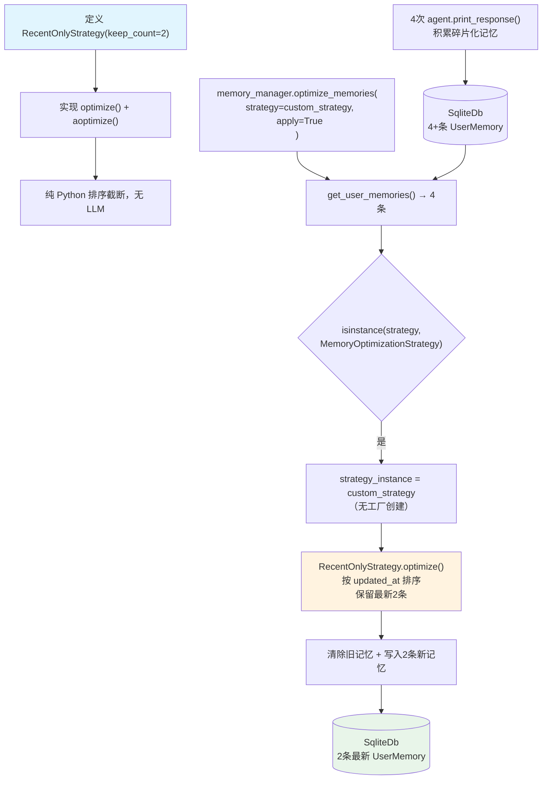

# 02_custom_memory_strategy.py — 实现原理分析

> 源文件：`cookbook/11_memory/optimize_memories/02_custom_memory_strategy.py`

## 概述

本示例展示 **自定义 `MemoryOptimizationStrategy` 子类** 机制：通过继承 `MemoryOptimizationStrategy` 抽象类并实现 `optimize()` 和 `aoptimize()` 方法，可以定义任意记忆优化逻辑（无需调用 LLM）。本例实现了 `RecentOnlyStrategy`，仅保留最近 N 条记忆，通过纯 Python 排序截断实现极轻量的优化。

**核心配置一览：**

| 配置项 | 值 | 说明 |
|--------|------|------|
| Agent `model` | `OpenAIChat("gpt-4o-mini")` | 主对话模型 |
| Agent `update_memory_on_run` | `True` | 每次运行后提取记忆 |
| MemoryManager `model` | `OpenAIChat("gpt-4o-mini")` | 记忆提取模型 |
| 自定义策略 | `RecentOnlyStrategy(keep_count=2)` | 保留最近 2 条，无 LLM |
| `apply` | `True` | 优化后写回 db |
| `db` | `SqliteDb("tmp/custom_memory_strategy.db")` | 本地存储 |

## 架构分层

```
用户代码层                              记忆优化层
┌──────────────────────────────────┐   ┌────────────────────────────────────────────────────────┐
│ 02_custom_memory_strategy.py     │   │ memory_manager.optimize_memories(                      │
│                                  │   │   user_id, strategy=RecentOnlyStrategy(2), apply=True) │
│ class RecentOnlyStrategy(        │   │  ├─ get_user_memories() → List[UserMemory]（4+条）      │
│   MemoryOptimizationStrategy):   │   │  ├─ isinstance(strategy, MemoryOptimizationStrategy)   │
│   def optimize(memories, model): │──>│  │    → strategy_instance = RecentOnlyStrategy(2)      │
│     sorted_memories[-keep_count:]│   │  ├─ strategy_instance.optimize(memories, model)        │
│                                  │   │  │    → 纯 Python 排序 + 截断（无 LLM 调用！）           │
│ memory_manager.optimize_memories(│   │  ├─ clear_user_memories(user_id)                       │
│   strategy=custom_strategy,      │   │  └─ db.upsert_user_memory() × 2                       │
│   apply=True,                    │   └────────────────────────────────────────────────────────┘
│ )                                │
└──────────────────────────────────┘
          （无独立 LLM 调用，全程纯 Python）
```

## 核心组件解析

### MemoryOptimizationStrategy 抽象基类

```python
# memory/strategies/base.py L9
class MemoryOptimizationStrategy(ABC):
    @abstractmethod
    def optimize(self, memories: List[UserMemory], model: Model) -> List[UserMemory]:
        """同步优化接口"""
        raise NotImplementedError

    @abstractmethod
    async def aoptimize(self, memories: List[UserMemory], model: Model) -> List[UserMemory]:
        """异步优化接口"""
        raise NotImplementedError

    def count_tokens(self, memories: List[UserMemory]) -> int:
        return sum(count_text_tokens(m.memory or "") for m in memories)
```

子类必须同时实现 `optimize()` 和 `aoptimize()`，保证同步/异步双路径可用。

### RecentOnlyStrategy — 纯 Python 实现

```python
class RecentOnlyStrategy(MemoryOptimizationStrategy):
    def __init__(self, keep_count: int = 2):
        self.keep_count = keep_count

    def optimize(self, memories: List[UserMemory], model: Model) -> List[UserMemory]:
        # 按 updated_at 或 created_at 降序排列（最新在前）
        sorted_memories = sorted(
            memories,
            key=lambda m: m.updated_at or m.created_at or datetime.min,
            reverse=True,
        )
        return sorted_memories[:self.keep_count]  # 保留最新 N 条

    async def aoptimize(self, memories, model):
        # 与同步版本逻辑相同
        sorted_memories = sorted(memories, key=..., reverse=True)
        return sorted_memories[:self.keep_count]
```

**关键特点：**
- `model` 参数虽然传入，但 `RecentOnlyStrategy` 完全不调用 LLM
- 通过纯 Python 日期排序实现，零 API 成本
- 每次调用耗时接近 O(n log n)（排序），极为高效

### 与 SummarizeStrategy 对比

| 维度 | `SummarizeStrategy` | `RecentOnlyStrategy`（自定义） |
|------|--------------------|-----------------------------|
| 是否调用 LLM | 是（每次优化调用 1 次） | 否（纯 Python） |
| 优化结果 | 1 条综合摘要 | N 条原始记忆（最新的） |
| token 压缩 | 高（语义合并） | 中（删除旧记忆） |
| 信息损失 | 可能合并细节 | 旧记忆完全丢失 |
| 适用场景 | 全量保留，节省 token | 仅需最近状态，丢弃历史 |

### 传入策略实例 vs 枚举

```python
# 方式1：传入枚举（使用内置策略）
memory_manager.optimize_memories(strategy=MemoryOptimizationStrategyType.SUMMARIZE)

# 方式2：传入策略实例（自定义策略）
custom_strategy = RecentOnlyStrategy(keep_count=2)
memory_manager.optimize_memories(strategy=custom_strategy, apply=True)
# optimize_memories() 检测 isinstance(strategy, MemoryOptimizationStrategy) 为 True
# 直接使用 strategy 实例，不走工厂
```

## 优化流程演示

```python
# 4次对话后积累的记忆（示例）：
# Memory 1: User is learning machine learning for 6 months (最旧)
# Memory 2: User completed neural networks course on Coursera
# Memory 3: User wants to build AI projects for real-world problems
# Memory 4: User is interested in NLP and transformer architectures (最新)

custom_strategy = RecentOnlyStrategy(keep_count=2)
memory_manager.optimize_memories(user_id=user_id, strategy=custom_strategy, apply=True)

# 优化后（保留最新2条）：
# Memory 3: User wants to build AI projects
# Memory 4: User interested in NLP and transformers
```

## Mermaid 流程图



## 关键源码文件索引

| 文件 | 关键函数/类 | 作用 |
|------|------------|------|
| `agno/memory/strategies/base.py` | `MemoryOptimizationStrategy` L9 | 抽象基类（定义接口） |
| `agno/memory/strategies/base.py` | `count_tokens()` L58 | Token 统计工具 |
| `agno/memory/manager.py` | `optimize_memories()` L793 | 接受策略实例或枚举 |
| `agno/memory/strategies/types.py` | `MemoryOptimizationStrategyFactory` L14 | 内置策略工厂（自定义策略不经此） |
| `agno/db/schemas.py` | `UserMemory` | 记忆数据结构（含 updated_at/created_at） |
