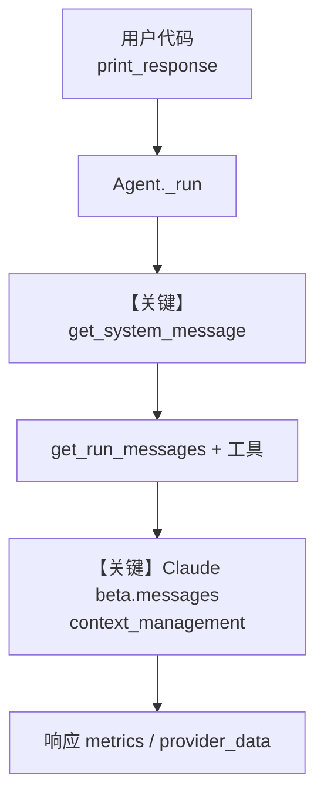

# context_management.py — 实现原理分析

> 源文件：`cookbook/90_models/anthropic/context_management.py`

## 概述

本示例展示 Agno 与 **Anthropic Claude「上下文管理 / Context Management」**（自动清理工具结果以降低长对话 token）的集成：在 `Claude` 上开启 beta 与 `context_management` 配置，并结合联网搜索与会话历史。

**核心配置一览：**

| 配置项 | 值 | 说明 |
|--------|------|------|
| `model` | `Claude(id="claude-sonnet-4-5", betas=[...], context_management={...})` | Messages API + beta 上下文编辑 |
| `instructions` | `"You are a helpful assistant with access to the web."` | 系统侧行为约束 |
| `tools` | `[WebSearchTools()]` | 可调用联网搜索 |
| `session_id` | `"context-editing"` | 固定会话，便于观察历史与指标 |
| `add_history_to_context` | `True` | 将历史注入上下文 |
| `markdown` | `True` | 默认系统里追加 Markdown 格式说明 |
| `description` | 未设置 | `None` |
| `db` | 未设置 | `None` |
| `system_message` | 未设置 | 走默认拼装 |

## 架构分层

```
用户代码层                agno.agent 层
┌──────────────────┐    ┌──────────────────────────────────┐
│ context_management│    │ Agent.print_response / _run()   │
│ .py              │    │  get_system_message()             │
│ Claude+betas+    │───>│  get_run_messages()               │
│ context_mgmt     │    │  工具循环 + 模型 invoke           │
└──────────────────┘    └──────────────────────────────────┘
                                │
                                ▼
                        ┌──────────────┐
                        │ Claude       │
                        │ beta.messages│
                        └──────────────┘
```

## 核心组件解析

### Claude 上下文管理（beta）

在 `Claude` 构造参数中传入 `betas=["context-management-2025-06-27"]` 与 `context_management`，请求会走带 beta 的 Anthropic 客户端路径；服务端按 `edits` 规则在适当时机清理部分 tool 结果，降低后续轮次的输入 token。

### 运行机制与因果链

1. **数据路径**：用户字符串 → `get_run_messages()` 组消息 → `Claude.invoke` / 流式 → 多轮工具调用后，提供商在响应中返回 `provider_data` 中的上下文管理统计。
2. **状态与副作用**：`session_id` + `add_history_to_context` 会读写会话存储（若配置了 db 则落库；本示例未显式 `db`，行为依默认会话后端）。工具结果被编辑后体现在后续 `messages` 与 metrics。
3. **关键分支**：若未设置 `betas`/`context_management`，则不会启用该能力；若工具调用次数未达 trigger，可能不会触发 clear。
4. **定位**：在「Anthropic 模型」主题下，本文件专门演示 **Context Management** 与长工具链场景，而非基础对话。

## System Prompt 组装

| 序号 | 组成部分 | 本文件中的值/来源 | 是否生效 |
|------|---------|------------------|---------|
| 1 | `description` | 未设置 | 否 |
| 2 | `role` | 未设置 | 否 |
| 3 | `instructions` | 见下「还原」 | 是 |
| 4.1 | `markdown` | `True` | 是（追加 Markdown 使用说明，且无 `output_schema`） |
| 4.2–4.4 | datetime/location/name | 未设置 | 否 |

### 拼装顺序与源码锚点

默认路径：`get_system_message()`（`agno/agent/_messages.py`）按 `# 3.3.1`–`# 3.3.4` 等顺序拼装；本示例未设 `agent.system_message`，故不早退于 L129–152。

### 还原后的完整 System 文本

```text
You are a helpful assistant with access to the web.

Use markdown to format your answers.
```

（若需确认完整默认段，可在 `get_system_message()` 返回前对 `Message.content` 打断点。）

### 段落释义（模型视角）

- **instructions**：定义助手角色与「可联网」预期。
- **Markdown 段**：约束输出使用 Markdown，便于终端渲染。

### 与 User / Developer 消息的边界

用户消息为 `print_response` 传入的英文查询；Anthropic 适配器将拼装后的 system 与 user/tool 消息一并送入 `messages.create` / `beta.messages.create`。

## 完整 API 请求

```python
# Anthropic Messages（带 beta 时走 beta.messages.create，见 claude.py L580–586）
# system: [{"type":"text","text": "<上节还原的 system>"}]
# messages: [user 多模态/文本 ...], 含历史时追加多轮
```

> 流式与否由 `print_response` 默认决定；本示例主调用未显式 `stream=True`。System 文本与第五节一致。

## Mermaid 流程图



- **【关键】get_system_message**：拼出默认 system，无自定义 `system_message`。
- **【关键】Claude beta.messages**：beta 与 context_management 仅在提供商侧生效。

## 关键源码文件索引

| 文件 | 关键函数/类 | 作用 |
|------|------------|------|
| `agno/agent/_messages.py` | `get_system_message()` L106–448 | 默认 system 拼装 |
| `agno/models/anthropic/claude.py` | `invoke()` L563–593 | `messages` / `beta.messages.create` |
| `agno/agent/agent.py` | `Agent` | `session_id`、`add_history_to_context` |
