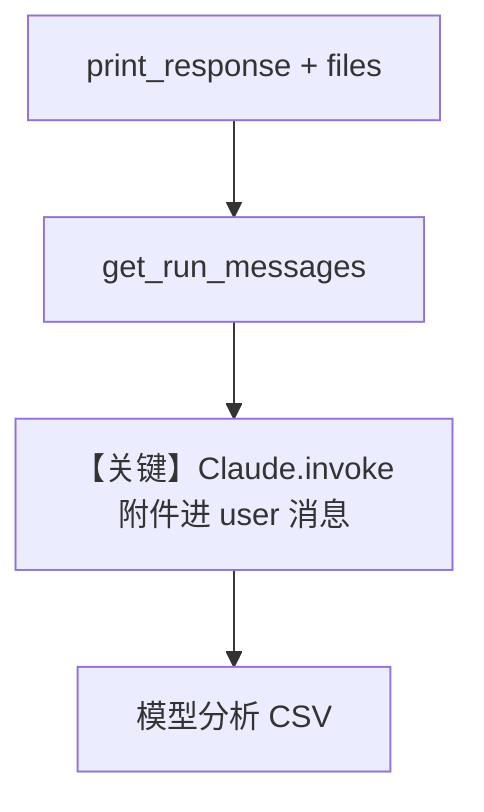

# csv_input.py — 实现原理分析

> 源文件：`cookbook/90_models/anthropic/csv_input.py`

## 概述

本示例展示 Agno 的 **`File` 媒体输入** 与 **Anthropic Claude**：将本地 CSV 作为附件随用户问题送入模型，用于表格分析类任务。

**核心配置一览：**

| 配置项 | 值 | 说明 |
|--------|------|------|
| `model` | `Claude(id="claude-sonnet-4-20250514")` | Anthropic Messages API |
| `markdown` | `True` | 追加 Markdown 格式说明 |
| `instructions` | 未设置 | 默认无额外 instructions 字符串 |
| `tools` | 未设置 | `None` |
| `files` / 调用时 | `File(filepath=..., mime_type="text/csv")` | 在 `print_response` 中传入 |

## 架构分层

```
用户代码层                agno.agent 层
┌──────────────────┐    ┌──────────────────────────────────┐
│ csv_input.py     │    │ print_response(query, files=[...])│
│ CSV + 分析问题    │───>│ get_run_messages 附加 File        │
└──────────────────┘    └──────────────────────────────────┘
                                │
                                ▼
                        ┌──────────────┐
                        │ Claude       │
                        └──────────────┘
```

## 核心组件解析

### File + CSV

`download_file` 拉取演示数据后，`File` 指定 `mime_type="text/csv"`，便于适配器按文档类型编码进用户消息。

### 运行机制与因果链

1. **路径**：用户问题 + 文件 → `get_run_messages()` → `Claude.invoke` → Anthropic 解析附件。
2. **副作用**：仅本地写 CSV 文件；无 db/knowledge。
3. **分支**：无工具则无工具循环；单次问答为主。
4. **定位**：同目录下聚焦 **表格文件作为上下文**，与图片/PDF 示例互补。

## System Prompt 组装

未设置 `instructions`；`markdown=True` 生效。

### 还原后的完整 System 文本

```text
Use markdown to format your answers.
```

（另有模型侧 `get_system_message_for_model` 可能追加内容，需运行时确认。）

### 段落释义

- 要求模型用 Markdown 输出，便于阅读表格结论。

## 完整 API 请求

```python
# claude.py: messages.create(model=..., messages=[...], system=[...])
# user 消息中含 CSV 附件块（由 format_messages 生成）
```

## Mermaid 流程图



## 关键源码文件索引

| 文件 | 关键函数/类 | 作用 |
|------|------------|------|
| `agno/agent/_messages.py` | `get_run_messages()` | 合并用户消息与媒体 |
| `agno/models/anthropic/claude.py` | `invoke()` L563+ | 发往 Anthropic |
