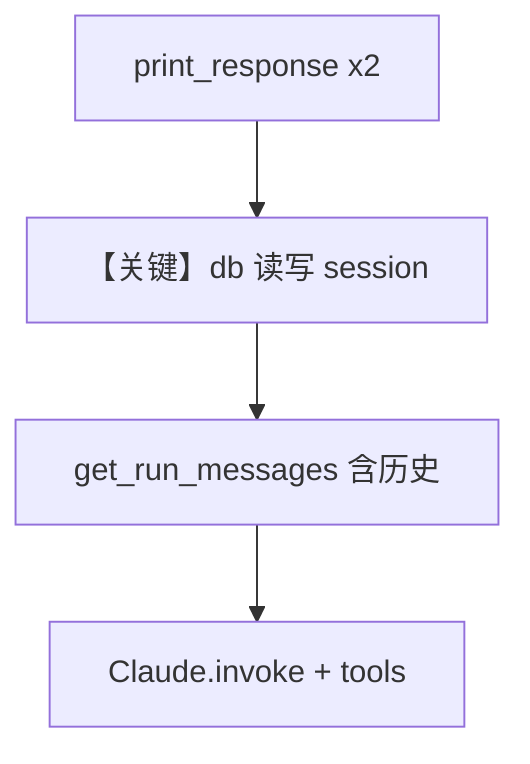

# db.py — 实现原理分析

> 源文件：`cookbook/90_models/anthropic/db.py`

## 概述

本示例展示 Agno 的 **`PostgresDb` 会话存储** 与 **Claude + WebSearchTools**：在多轮对话中持久化历史，第二问可依赖第一问上下文。

**核心配置一览：**

| 配置项 | 值 | 说明 |
|--------|------|------|
| `model` | `Claude(id="claude-sonnet-4-20250514")` | Messages API |
| `db` | `PostgresDb(db_url=...)` | PostgreSQL 会话/运行记录 |
| `tools` | `[WebSearchTools()]` | 联网搜索 |
| `add_history_to_context` | `True` | 历史注入消息 |
| `markdown` | 未设置 | 默认 `False`（依 Agent 默认） |
| `instructions` | 未设置 | 无 |

## 架构分层

```
用户代码层                agno.agent 层
┌──────────────────┐    ┌──────────────────────────────────┐
│ db.py            │    │ Agent.run 读写 session via db     │
│ PostgresDb       │───>│ get_run_messages 含历史           │
└──────────────────┘    └──────────────────────────────────┘
                                ▼
                        Claude + tools 循环
```

## 核心组件解析

### PostgresDb

`db_url` 指向本地 Postgres；`print_response` 两次调用共享同一会话（默认 session）时从 db 取历史。

### 运行机制与因果链

1. **路径**：用户问题 → 存运行 → 组装含历史的 messages → `Claude.invoke`。
2. **副作用**：写入 Postgres（session、messages 等，依 agno db 实现）。
3. **分支**：`add_history_to_context=False` 则第二问看不到第一问。
4. **定位**：与纯 `InMemoryDb` 相比，演示 **生产向持久化**。

## System Prompt 组装

无 `instructions`；若默认 `markdown` 为 False，则无「Use markdown...」段（见 `_messages.py` `# 3.2.1` 条件 `agent.markdown and output_schema is None`）。

### 还原后的完整 System 文本

无法仅从本文件静态确定是否含 Markdown 段；默认 Agent `markdown` 常为 `False`。建议在 `get_system_message()` 返回处打印确认。

### 段落释义

- 工具相关说明由 `get_tools` / 模型侧 instruction 补充。

## 完整 API 请求

```python
# 第二次 run：messages 含首轮 user/assistant（来自 db 恢复的历史）
# tools: WebSearch 工具 schema
```

## Mermaid 流程图



## 关键源码文件索引

| 文件 | 关键函数/类 | 作用 |
|------|------------|------|
| `agno/db/postgres.py` | `PostgresDb` | 持久化 |
| `agno/agent/_messages.py` | `get_run_messages()` | 历史合并 |
| `agno/models/anthropic/claude.py` | `invoke()` | API 调用 |
