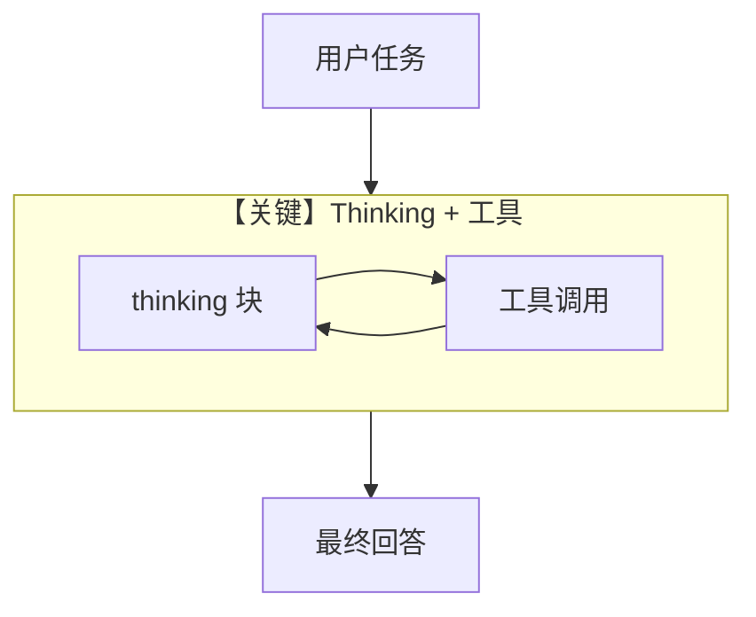

# financial_analyst_thinking.py — 实现原理分析

> 源文件：`cookbook/90_models/anthropic/financial_analyst_thinking.py`

## 概述

本示例展示 **Extended Thinking（思考预算）** 与 **interleaved thinking beta**、结合 **CalculatorTools** 与 **YFinanceTools** 的复杂财务推理任务。

**核心配置一览：**

| 配置项 | 值 | 说明 |
|--------|------|------|
| `model` | `Claude(..., thinking={...}, betas=[...])` | 启用思考与 beta |
| `tools` | `[CalculatorTools(), YFinanceTools()]` | 计算与行情 |
| `instructions` | 多行 list | 金融助手行为 |
| `markdown` | `True` | Markdown 输出 |

## 架构分层

用户任务字符串 → Agent → `get_system_message` + tools → Claude `beta.messages`（因 thinking/beta）→ 可能多轮工具与思考块。

## 核心组件解析

### thinking + betas

`thinking={"type": "enabled", "budget_tokens": 2048}` 与 `betas=["interleaved-thinking-2025-05-14"]` 触发 `_has_beta_features`，走 `beta.messages`（见 `claude.py` L580–586）。

### 运行机制与因果链

1. **路径**：长任务 → 模型可先输出思考再调工具，循环直至回答。
2. **副作用**：无额外 db；仅 API 侧 token 计量。
3. **分支**：无 `betas` 则可能无法使用 interleaved thinking API。
4. **定位**：在 `thinking.py` 基础之上叠加 **真实工具 + 金融领域 instructions**。

## System Prompt 组装

### 还原后的完整 System 文本（instructions + markdown）

```text
- You are a financial analysis assistant with access to calculator and stock price tools.
- For complex problems, think through each step carefully before and after using tools.
- Show your reasoning process and explain your calculations clearly.
- Use the calculator tool for all mathematical operations to ensure accuracy.

Use markdown to format your answers.
```

（`use_instruction_tags` 默认下多条 instructions 以 `- ` 行拼接，见 `_messages.py` `# 3.3.3`。）

## 完整 API 请求

```python
# beta.messages.create(model=..., messages=..., system=..., tools=...)
# 含 thinking 参数由 Claude 模型类在 _prepare_request_kwargs 中合并
```

## Mermaid 流程图



## 关键源码文件索引

| 文件 | 关键函数/类 | 作用 |
|------|------------|------|
| `agno/models/anthropic/claude.py` | `_prepare_request_kwargs` / `invoke` | beta 与 thinking |
| `agno/agent/_messages.py` | `get_system_message()` | instructions 列表拼装 |
