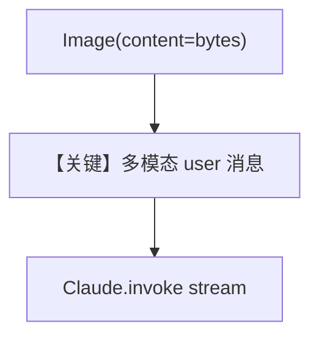

# image_input_bytes.py — 实现原理分析

<!-- cookbook-py-source:start -->
## 完整源码

```python
"""
Anthropic Image Input Bytes
===========================

Cookbook example for `anthropic/image_input_bytes.py`.
"""

from pathlib import Path

from agno.agent import Agent
from agno.media import Image
from agno.models.anthropic.claude import Claude
from agno.tools.websearch import WebSearchTools
from agno.utils.media import download_image

# ---------------------------------------------------------------------------
# Create Agent
# ---------------------------------------------------------------------------

agent = Agent(
    model=Claude(id="claude-sonnet-4-20250514"),
    tools=[WebSearchTools()],
    markdown=True,
)

image_path = Path(__file__).parent.joinpath("sample.jpg")

download_image(
    url="https://upload.wikimedia.org/wikipedia/commons/0/0c/GoldenGateBridge-001.jpg",
    output_path=str(image_path),
)

# Read the image file content as bytes
image_bytes = image_path.read_bytes()

agent.print_response(
    "Tell me about this image and give me the latest news about it.",
    images=[
        Image(content=image_bytes),
    ],
    stream=True,
)

# ---------------------------------------------------------------------------
# Run Agent
# ---------------------------------------------------------------------------

if __name__ == "__main__":
    pass
```

<!-- cookbook-py-source:end -->

> 源文件：`cookbook/90_models/anthropic/image_input_bytes.py`

## 概述

本示例展示 **`Image(content=bytes)`** 与 Claude：从磁盘读入 JPEG 字节，作为多模态用户消息发送。

**核心配置一览：**

| 配置项 | 值 | 说明 |
|--------|------|------|
| `model` | `Claude(id="claude-sonnet-4-20250514")` | Vision |
| `tools` | `[WebSearchTools()]` | 看图后可联网 |
| `markdown` | `True` | 格式化输出 |
| `images` | `[Image(content=image_bytes)]` | 调用参数 |

## 核心组件解析

### Image 字节

`Image(content=...)` 避免上传文件 API，直接嵌入请求体（由 agno 媒体层编码）。

### 运行机制与因果链

1. **路径**：字节 → user 多模态消息 → Claude。
2. **副作用**：无。
3. **分支**：也可用 `url`/`filepath`（见同目录其他示例）。
4. **定位**：强调 **内存字节** 路径。

## System Prompt 组装

无 `instructions`；`markdown=True`。

### 还原后的完整 System 文本

```text
Use markdown to format your answers.
```

## 完整 API 请求

Anthropic `messages` 中 user content 含 `image` block（base64 等，由 `format_messages` 处理）。

## Mermaid 流程图



## 关键源码文件索引

| 文件 | 关键函数/类 | 作用 |
|------|------------|------|
| `agno/models/anthropic/claude.py` | `format_messages` / `invoke` | 媒体编码 |
| `agno/agent/_messages.py` | `get_run_messages()` | 合并消息 |
