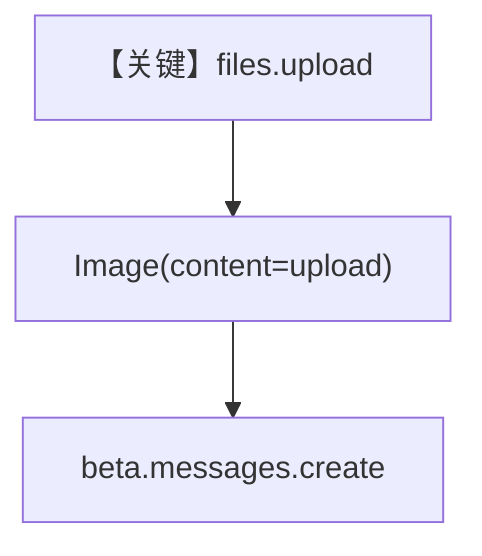

# image_input_file_upload.py — 实现原理分析

<!-- cookbook-py-source:start -->
## 完整源码

```python
"""
In this example, we upload a PDF file to Anthropic directly and then use it as an input to an agent.
"""

from pathlib import Path

from agno.agent import Agent
from agno.media import Image
from agno.models.anthropic import Claude
from agno.utils.media import download_file
from anthropic import Anthropic

# ---------------------------------------------------------------------------
# Create Agent
# ---------------------------------------------------------------------------

img_path = Path(__file__).parent.joinpath("agno-intro.png")

# Download the file using the download_file function
download_file(
    "https://agno-public.s3.us-east-1.amazonaws.com/images/agno-intro.png",
    str(img_path),
)

# Initialize Anthropic client
client = Anthropic()

# Upload the file to Anthropic
uploaded_file = client.beta.files.upload(
    file=Path(img_path),
)

if uploaded_file is not None:
    agent = Agent(
        model=Claude(
            id="claude-opus-4-20250514",
            betas=["files-api-2025-04-14"],
        ),
        markdown=True,
    )

    agent.print_response(
        "What does the attached image say.",
        images=[Image(content=uploaded_file)],
    )

# ---------------------------------------------------------------------------
# Run Agent
# ---------------------------------------------------------------------------

if __name__ == "__main__":
    pass
```

<!-- cookbook-py-source:end -->

> 源文件：`cookbook/90_models/anthropic/image_input_file_upload.py`

## 概述

本示例展示 **Anthropic Files API（beta）**：先用官方 `Anthropic` 客户端上传图片，再把返回的 file 对象交给 **`Image(content=uploaded_file)`**，模型 id 使用支持该能力的版本并开启 `betas`。

**核心配置一览：**

| 配置项 | 值 | 说明 |
|--------|------|------|
| `model` | `Claude(id="claude-opus-4-20250514", betas=["files-api-2025-04-14"])` | Files beta |
| `markdown` | `True` | 默认 system 含 Markdown 说明 |
| `images` | `[Image(content=uploaded_file)]` | 引用已上传文件 |

## 核心组件解析

### 上传与引用

`client.beta.files.upload` 返回对象传入 `Image`，由 agno 转为提供商所需引用格式，避免本地再大段传 bytes。

### 运行机制与因果链

1. **路径**：本地上传 → file id → 模型请求引用该资源。
2. **副作用**：Anthropic 账户侧保留上传文件（策略依提供商）。
3. **分支**：`uploaded_file is None` 则不创建 Agent（脚本结构）。
4. **定位**：与 `image_input_local_file`（filepath）对比，本示例走 **托管文件 ID**。

## System Prompt 组装

### 还原后的完整 System 文本

```text
Use markdown to format your answers.
```

## 完整 API 请求

走 `beta.messages.create`（因 `betas`），user 中含对上传文件的引用。

## Mermaid 流程图



## 关键源码文件索引

| 文件 | 关键函数/类 | 作用 |
|------|------------|------|
| `agno/models/anthropic/claude.py` | `_has_beta_features` / `invoke` | beta 路径 |
