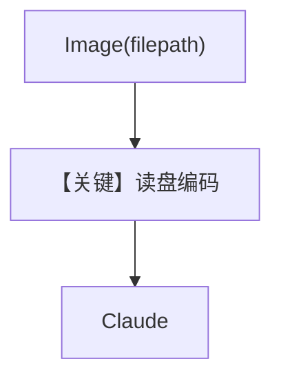

# image_input_local_file.py — 实现原理分析

> 源文件：`cookbook/90_models/anthropic/image_input_local_file.py`

## 概述

本示例展示 **`Image(filepath=...)`**：本地路径图片随问题发送给 Claude，无需自管 bytes。

**核心配置一览：**

| 配置项 | 值 | 说明 |
|--------|------|------|
| `model` | `Claude(id="claude-sonnet-4-20250514")` | Vision |
| `markdown` | `True` | Markdown |
| `images` | `[Image(filepath=img_path)]` | 本地路径 |

## 架构分层

下载到本地 → `Image(filepath)` → `get_run_messages` → `Claude.invoke`。

## 核心组件解析

### 运行机制与因果链

1. **路径**：框架读取 filepath 编码进多模态消息。
2. **副作用**：无 db。
3. **与 bytes/url 示例差异**：最适合「已有本地文件」场景。

## System Prompt 组装

### 还原后的完整 System 文本

```text
Use markdown to format your answers.
```

## 完整 API 请求

`messages` user 部分含图片块（由 agno 从文件读取并编码）。

## Mermaid 流程图



## 关键源码文件索引

| 文件 | 关键函数/类 | 作用 |
|------|------------|------|
| `agno/media` | `Image` | 多模态封装 |
| `agno/models/anthropic/claude.py` | `invoke()` | API |
