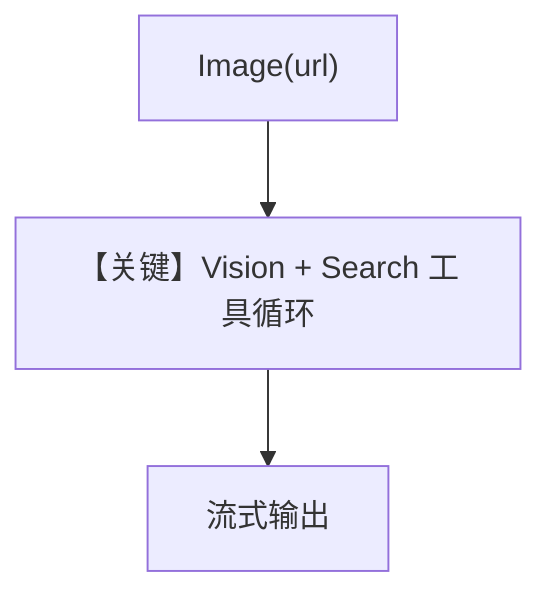

# image_input_url.py — 实现原理分析

<!-- cookbook-py-source:start -->
## 完整源码

```python
"""
Anthropic Image Input Url
=========================

Cookbook example for `anthropic/image_input_url.py`.
"""

from agno.agent import Agent
from agno.media import Image
from agno.models.anthropic import Claude
from agno.tools.websearch import WebSearchTools

# ---------------------------------------------------------------------------
# Create Agent
# ---------------------------------------------------------------------------

agent = Agent(
    model=Claude(id="claude-sonnet-4-20250514"),
    tools=[WebSearchTools()],
    markdown=True,
)

agent.print_response(
    "Tell me about this image and search the web for more information.",
    images=[
        Image(
            url="https://upload.wikimedia.org/wikipedia/commons/0/0c/GoldenGateBridge-001.jpg"
        ),
    ],
    stream=True,
)

# ---------------------------------------------------------------------------
# Run Agent
# ---------------------------------------------------------------------------

if __name__ == "__main__":
    pass
```

<!-- cookbook-py-source:end -->

> 源文件：`cookbook/90_models/anthropic/image_input_url.md`

## 概述

本示例展示 **`Image(url=...)`** 与 **WebSearchTools**：模型可基于远程图片内容再联网补充信息。

**核心配置一览：**

| 配置项 | 值 | 说明 |
|--------|------|------|
| `model` | `Claude(id="claude-sonnet-4-20250514")` | Vision + 工具 |
| `tools` | `[WebSearchTools()]` | 联网 |
| `markdown` | `True` | Markdown |
| `images` | `[Image(url=...)]` | 远程图片 |

## 核心组件解析

### 运行机制与因果链

1. **路径**：URL 可能被 agno 拉取或转为提供商支持的引用（依实现）；随后可进入工具循环。
2. **副作用**：无持久化。
3. **定位**：**URL 图片** 与 bytes/filepath 对照。

## System Prompt 组装

### 还原后的完整 System 文本

```text
Use markdown to format your answers.
```

## 完整 API 请求

含 tools 的 `messages.create`；user 中含图像与文本。

## Mermaid 流程图



## 关键源码文件索引

| 文件 | 关键函数/类 | 作用 |
|------|------------|------|
| `agno/models/anthropic/claude.py` | `invoke()` L563+ | 工具与消息 |
| `agno/agent/_tools.py` | `get_tools()` | 工具 schema |
