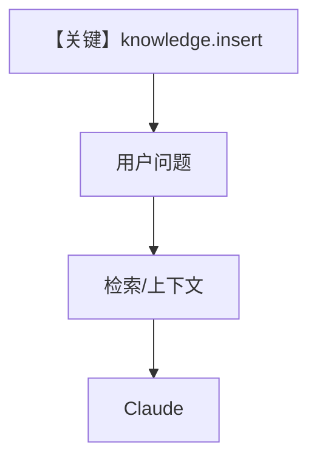

# knowledge.py — 实现原理分析

<!-- cookbook-py-source:start -->
## 完整源码

```python
"""Run `uv pip install ddgs sqlalchemy pgvector pypdf anthropic openai` to install dependencies."""

from agno.agent import Agent
from agno.knowledge.embedder.azure_openai import AzureOpenAIEmbedder
from agno.knowledge.knowledge import Knowledge
from agno.models.anthropic import Claude
from agno.vectordb.pgvector import PgVector

# ---------------------------------------------------------------------------
# Create Agent
# ---------------------------------------------------------------------------

db_url = "postgresql+psycopg://ai:ai@localhost:5532/ai"

knowledge = Knowledge(
    vector_db=PgVector(
        table_name="recipes",
        db_url=db_url,
        embedder=AzureOpenAIEmbedder(),
    ),
)
# Add content to the knowledge
knowledge.insert(url="https://agno-public.s3.amazonaws.com/recipes/ThaiRecipes.pdf")

agent = Agent(
    model=Claude(id="claude-sonnet-4-20250514"),
    knowledge=knowledge,
)
agent.print_response("How to make Thai curry?", markdown=True)

# ---------------------------------------------------------------------------
# Run Agent
# ---------------------------------------------------------------------------

if __name__ == "__main__":
    pass
```

<!-- cookbook-py-source:end -->

> 源文件：`cookbook/90_models/anthropic/knowledge.py`

## 概述

本示例展示 **`Knowledge` + PgVector + AzureOpenAIEmbedder** 与 Claude：先入库 PDF，再由 Agent 默认 **`search_knowledge=True`**（`agent.py` 默认）触发检索与系统提示中的知识库说明。

**核心配置一览：**

| 配置项 | 值 | 说明 |
|--------|------|------|
| `model` | `Claude(id="claude-sonnet-4-20250514")` | Messages |
| `knowledge` | `Knowledge(vector_db=PgVector(...), ...)` | RAG |
| `search_knowledge` | 未显式传入 | 默认 `True` |
| `print_response` | `markdown=True` | 输出格式 |

## 核心组件解析

### Knowledge.insert

`knowledge.insert(url=...)` 拉取 PDF 并向量化写入 PgVector。

### 运行机制与因果链

1. **路径**：问题 → 若启用检索则向量检索片段进入 system 或 context → Claude。
2. **副作用**：Postgres/pgvector 写入；embedder 调用 Azure。
3. **定位**：Anthropic 模型 + **Azure 嵌入** 的 RAG 示例。

## System Prompt 组装

默认 `search_knowledge=True` 且 `add_search_knowledge_instructions=True` 时，`_messages.py` `# 3.3.13` 通过 `knowledge.build_context(...)` 追加检索相关说明。

### 还原后的完整 System 文本

知识库生成的正文依赖向量检索结果与 PDF 内容，**无法静态逐字还原**；请在 `get_system_message()` 返回前打印 `message.content` 验证。

## 完整 API 请求

Claude `messages.create` + 含检索增强后的 system/user。

## Mermaid 流程图



## 关键源码文件索引

| 文件 | 关键函数/类 | 作用 |
|------|------------|------|
| `agno/knowledge/knowledge.py` | `Knowledge` | RAG 入口 |
| `agno/agent/_messages.py` | `# 3.3.13` | 知识说明注入 |
| `agno/models/anthropic/claude.py` | `invoke()` | 调用 |
