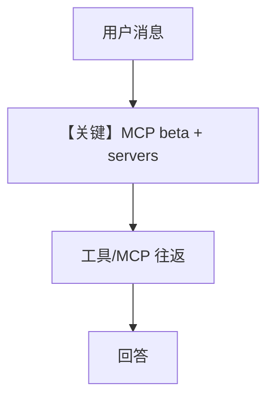

# mcp_connector.py — 实现原理分析

<!-- cookbook-py-source:start -->
## 完整源码

```python
"""
Anthropic Mcp Connector
=======================

Cookbook example for `anthropic/mcp_connector.py`.
"""

from agno.agent import Agent
from agno.models.anthropic import Claude
from agno.utils.models.claude import MCPServerConfiguration

# ---------------------------------------------------------------------------
# Create Agent
# ---------------------------------------------------------------------------

agent = Agent(
    model=Claude(
        id="claude-sonnet-4-20250514",
        betas=["mcp-client-2025-04-04"],
        mcp_servers=[
            MCPServerConfiguration(
                type="url",
                name="deepwiki",
                url="https://mcp.deepwiki.com/sse",
            )
        ],
    ),
    markdown=True,
)

agent.print_response(
    "Tell me about https://github.com/agno-agi/agno",
    stream=True,
)

# ---------------------------------------------------------------------------
# Run Agent
# ---------------------------------------------------------------------------

if __name__ == "__main__":
    pass
```

<!-- cookbook-py-source:end -->

> 源文件：`cookbook/90_models/anthropic/mcp_connector.py`

## 概述

本示例展示 **Claude MCP 客户端 beta**：通过 `mcp_servers` 与 `MCPServerConfiguration` 连接远程 MCP（如 DeepWiki SSE），扩展工具能力。

**核心配置一览：**

| 配置项 | 值 | 说明 |
|--------|------|------|
| `model` | `Claude(id="...", betas=["mcp-client-2025-04-04"], mcp_servers=[...])` | MCP beta |
| `markdown` | `True` | Markdown |

## 核心组件解析

### MCPServerConfiguration

`type="url"` + `url` 指向 SSE 端点；请求走 beta 路径，由 Anthropic 侧拉取 MCP 工具定义。

### 运行机制与因果链

1. **路径**：用户 URL 问题 → 模型可经 MCP 工具取结构化数据。
2. **副作用**：依赖外部 MCP 可用性。
3. **定位**：**Anthropic 原生 MCP 集成**，非 agno 自研 MCP 工具类。

## System Prompt 组装

### 还原后的完整 System 文本

```text
Use markdown to format your answers.
```

## 完整 API 请求

`beta.messages.create`，额外参数含 MCP 相关（由 `_prepare_request_kwargs` 合并）。

## Mermaid 流程图



## 关键源码文件索引

| 文件 | 关键函数/类 | 作用 |
|------|------------|------|
| `agno/utils/models/claude.py` | `MCPServerConfiguration` | 配置结构 |
| `agno/models/anthropic/claude.py` | `_prepare_request_kwargs` | 请求参数 |
