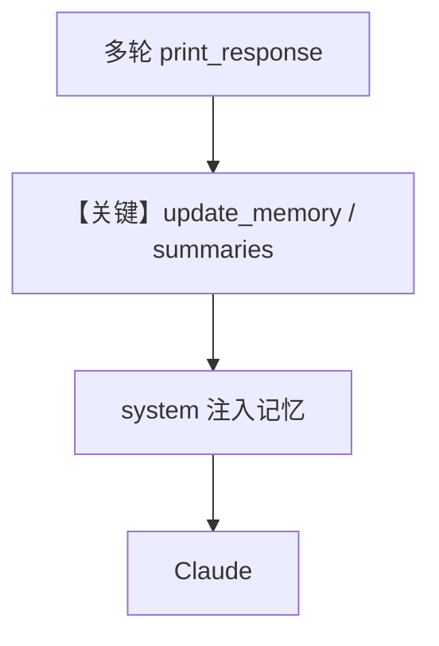

# memory.py — 实现原理分析

<!-- cookbook-py-source:start -->
## 完整源码

```python
"""
This recipe shows how to use personalized memories and summaries in an agent.
Steps:
1. Run: `./cookbook/scripts/run_pgvector.sh` to start a postgres container with pgvector
2. Run: `uv pip install anthropic sqlalchemy 'psycopg[binary]' pgvector` to install the dependencies
3. Run: `python cookbook/92_models/anthropic/memory.py` to run the agent
"""

from agno.agent import Agent
from agno.db.postgres import PostgresDb
from agno.models.anthropic import Claude

# ---------------------------------------------------------------------------
# Create Agent
# ---------------------------------------------------------------------------

# Setup the database
db_url = "postgresql+psycopg://ai:ai@localhost:5532/ai"
db = PostgresDb(db_url=db_url)

agent = Agent(
    model=Claude(id="claude-sonnet-4-20250514"),
    # Pass the database to the Agent
    db=db,
    # Store the memories and summary in the database
    update_memory_on_run=True,
    enable_session_summaries=True,
)

# -*- Share personal information
agent.print_response("My name is john billings?", stream=True)

# -*- Share personal information
agent.print_response("I live in nyc?", stream=True)

# -*- Share personal information
agent.print_response("I'm going to a concert tomorrow?", stream=True)

# Ask about the conversation
agent.print_response(
    "What have we been talking about, do you know my name?", stream=True
)

# ---------------------------------------------------------------------------
# Run Agent
# ---------------------------------------------------------------------------

if __name__ == "__main__":
    pass
```

<!-- cookbook-py-source:end -->

> 源文件：`cookbook/90_models/anthropic/memory.py`

## 概述

本示例展示 **`update_memory_on_run`**、**`enable_session_summaries`** 与 **PostgresDb**：在多轮对话中更新用户记忆与会话摘要，最后一问依赖记忆回答。

**核心配置一览：**

| 配置项 | 值 | 说明 |
|--------|------|------|
| `model` | `Claude(id="claude-sonnet-4-20250514")` | Messages |
| `db` | `PostgresDb(...)` | 存储 |
| `update_memory_on_run` | `True` | 运行后更新记忆 |
| `enable_session_summaries` | `True` | 会话摘要 |

## 核心组件解析

### 记忆与摘要

`get_system_message()` 中 `# 3.3.9`–`# 3.3.11` 等会在条件满足时注入 memories、summary 段落（见 `_messages.py`）。

### 运行机制与因果链

1. **路径**：每轮 `print_response` → 写 db → 下轮 system 可能含记忆块。
2. **副作用**：Postgres 持续写入。
3. **定位**：与无 `update_memory` 的 db 示例对比，强调 **个性化记忆**。

## System Prompt 组装

动态包含记忆与摘要文本；无法静态逐字还原全文。

### 验证方式

在 `get_system_message()` 返回前打印 `Message.content`。

## 完整 API 请求

标准 Claude 请求；system 随轮次变长（记忆段落）。

## Mermaid 流程图



## 关键源码文件索引

| 文件 | 关键函数/类 | 作用 |
|------|------------|------|
| `agno/agent/_messages.py` | `get_system_message()` L287–397 | memories/summary |
| `agno/memory/` | memory manager | 读写记忆 |
