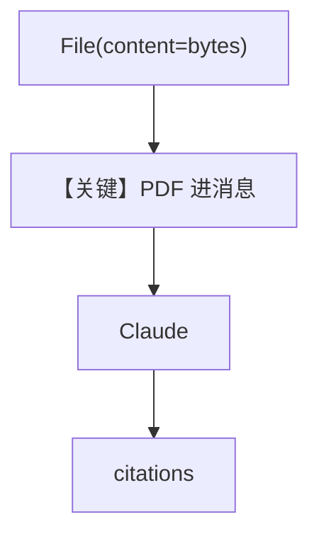

# pdf_input_bytes.py — 实现原理分析

<!-- cookbook-py-source:start -->
## 完整源码

```python
"""
Anthropic Pdf Input Bytes
=========================

Cookbook example for `anthropic/pdf_input_bytes.py`.
"""

from pathlib import Path

from agno.agent import Agent
from agno.media import File
from agno.models.anthropic import Claude
from agno.utils.media import download_file

# ---------------------------------------------------------------------------
# Create Agent
# ---------------------------------------------------------------------------

pdf_path = Path(__file__).parent.joinpath("ThaiRecipes.pdf")

# Download the file using the download_file function
download_file(
    "https://agno-public.s3.amazonaws.com/recipes/ThaiRecipes.pdf", str(pdf_path)
)

agent = Agent(
    model=Claude(id="claude-sonnet-4-20250514"),
    markdown=True,
)

agent.print_response(
    "Summarize the contents of the attached file.",
    files=[
        File(
            content=pdf_path.read_bytes(),
        ),
    ],
)
run_response = agent.get_last_run_output()
print("Citations:")
print(run_response.citations)

# ---------------------------------------------------------------------------
# Run Agent
# ---------------------------------------------------------------------------

if __name__ == "__main__":
    pass
```

<!-- cookbook-py-source:end -->

> 源文件：`cookbook/90_models/anthropic/pdf_input_bytes.py`

## 概述

本示例展示 **`File(content=bytes)`** 传入 PDF 字节，并在运行后读取 **`run_response.citations`**（若提供商返回引用）。

**核心配置一览：**

| 配置项 | 值 | 说明 |
|--------|------|------|
| `model` | `Claude(id="claude-sonnet-4-20250514")` | 文档理解 |
| `markdown` | `True` | Markdown |
| `files` | `File(content=pdf_path.read_bytes())` | PDF 字节 |

## 核心组件解析

### Citations

`get_last_run_output().citations` 展示模型引用 PDF 片段的元数据（若支持）。

### 运行机制与因果链

1. **路径**：PDF 字节进入 user 消息 → 模型总结。
2. **副作用**：无 db。
3. **定位**：**字节 PDF** 与 URL/本地路径/upload 对照。

## System Prompt 组装

### 还原后的完整 System 文本

```text
Use markdown to format your answers.
```

## 完整 API 请求

Anthropic user content 含 `document` 类型块（依 format_messages）。

## Mermaid 流程图



## 关键源码文件索引

| 文件 | 关键函数/类 | 作用 |
|------|------------|------|
| `agno/models/anthropic/claude.py` | `invoke` | 请求 |
| `agno/run/agent.py` | `RunOutput` | citations |
