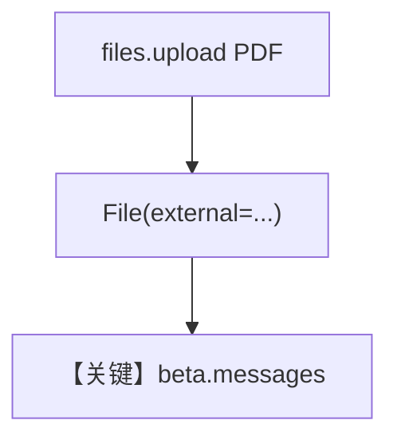

# pdf_input_file_upload.py — 实现原理分析

> 源文件：`cookbook/90_models/anthropic/pdf_input_file_upload.py`

## 概述

本示例展示 **Files API 上传 PDF** 后使用 **`File(external=uploaded_file)`** 与 `claude-opus` + files beta。

**核心配置一览：**

| 配置项 | 值 | 说明 |
|--------|------|------|
| `model` | `Claude(id="claude-opus-4-20250514", betas=["files-api-2025-04-14"])` | Files beta |
| `markdown` | `True` | Markdown |
| `files` | `File(external=uploaded_file)` | 引用上传结果 |

## 运行机制与因果链

1. **路径**：`beta.files.upload` → file 句柄 → `beta.messages` 引用文档。
2. **副作用**：云端保留上传文件。
3. **定位**：大文件优先走 **托管上传** 而非内联 bytes。

## System Prompt 组装

### 还原后的完整 System 文本

```text
Use markdown to format your answers.
```

## Mermaid 流程图



## 关键源码文件索引

| 文件 | 关键函数/类 | 作用 |
|------|------------|------|
| `agno/models/anthropic/claude.py` | `invoke` / beta | API 路径 |
