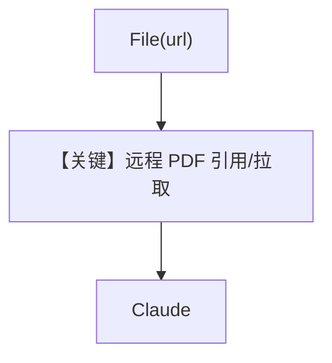

# pdf_input_url.py — 实现原理分析

> 源文件：`cookbook/90_models/anthropic/pdf_input_url.py`

## 概述

本示例展示 **`File(url=...)`** 直接使用远程 PDF URL 作为附件，无需先下载到本地（具体抓取行为由 agno/提供商链路完成）。

**核心配置一览：**

| 配置项 | 值 | 说明 |
|--------|------|------|
| `model` | `Claude(id="claude-sonnet-4-20250514")` | 文档 |
| `markdown` | `True` | Markdown |
| `files` | `File(url="https://...pdf")` | 远程 PDF |

## 运行机制与因果链

最少本地 IO；依赖网络可达 S3 URL。

## System Prompt 组装

### 还原后的完整 System 文本

```text
Use markdown to format your answers.
```

## Mermaid 流程图



## 关键源码文件索引

| 文件 | 关键函数/类 | 作用 |
|------|------------|------|
| `agno/models/anthropic/claude.py` | `format_messages` | URL 文档块 |
