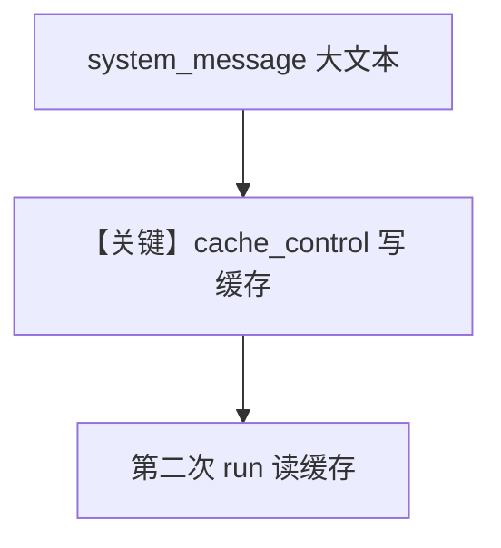

# prompt_caching.py — 实现原理分析

<!-- cookbook-py-source:start -->
## 完整源码

```python
"""
This cookbook shows how to use prompt caching with Agents using Anthropic models, to catch the system prompt passed to the model.

This can significantly reduce processing time and costs.
Use it when working with a static and large system prompt.

You can check more about prompt caching with Anthropic models here: https://docs.anthropic.com/en/docs/prompt-caching
"""

from pathlib import Path

from agno.agent import Agent
from agno.models.anthropic import Claude
from agno.utils.media import download_file

# ---------------------------------------------------------------------------
# Create Agent
# ---------------------------------------------------------------------------

# Load an example large system message from S3. A large prompt like this would benefit from caching.
txt_path = Path(__file__).parent.joinpath("system_prompt.txt")
download_file(
    "https://agno-public.s3.amazonaws.com/prompts/system_promt.txt",
    str(txt_path),
)
system_message = txt_path.read_text()

agent = Agent(
    model=Claude(
        id="claude-sonnet-4-20250514",
        cache_system_prompt=True,  # Activate prompt caching for Anthropic to cache the system prompt
    ),
    system_message=system_message,
    markdown=True,
)

# First run - this will create the cache
response = agent.run(
    "Explain the difference between REST and GraphQL APIs with examples"
)
if response and response.metrics:
    print(f"First run cache write tokens = {response.metrics.cache_write_tokens}")

# Second run - this will use the cached system prompt
response = agent.run(
    "What are the key principles of clean code and how do I apply them in Python?"
)
if response and response.metrics:
    print(f"Second run cache read tokens = {response.metrics.cache_read_tokens}")

# ---------------------------------------------------------------------------
# Run Agent
# ---------------------------------------------------------------------------

if __name__ == "__main__":
    pass
```

<!-- cookbook-py-source:end -->

> 源文件：`cookbook/90_models/anthropic/prompt_caching.py`

## 概述

本示例展示 **`cache_system_prompt=True`** 与 **`system_message`** 从本地大文本文件加载：首轮写入 prompt cache，次轮命中以降低延迟与费用。

**核心配置一览：**

| 配置项 | 值 | 说明 |
|--------|------|------|
| `model` | `Claude(id="claude-sonnet-4-20250514", cache_system_prompt=True)` | 系统 prompt 缓存 |
| `system_message` | 文件 `system_prompt.txt` 全文 | 早退分支 L129–152 |
| `markdown` | `True` | 若仍走默认会加 Markdown；此处自定义 system_message |

## 核心组件解析

### system_message 早退

`get_system_message()`：若 `agent.system_message` 非 `None`，直接返回该内容（可经 `resolve_in_context` 格式化），**不再**拼装默认 instructions 块（见 L129–152）。

### 运行机制与因果链

1. **路径**：`agent.run` 两次；metrics 中 `cache_write_tokens` / `cache_read_tokens` 反映缓存行为。
2. **副作用**：无 db；Anthropic 侧缓存状态。
3. **定位**：与 `prompt_caching_extended.py`（延长 TTL）对照。

## System Prompt 组装

| 组成部分 | 状态 |
|---------|------|
| 自定义 `system_message` | 是，整文件正文 |

### 还原后的完整 System 文本

正文等于下载后的 `system_prompt.txt`。仓库内路径为同目录 `system_prompt.txt`；远程内容为 `agno-public` 上 `system_promt.txt`（注意上游文件名拼写）。**静态分析无法嵌入完整正文**，请打开本地文件或运行 `txt_path.read_text()` 获取。

### 验证

打印 `get_system_message()` 返回的 `Message.content`。

## 完整 API 请求

`claude.py` 中 `cache_system_prompt` 为真时，`system` 带 `cache_control`（见 L531–537）。

## Mermaid 流程图



## 关键源码文件索引

| 文件 | 关键函数/类 | 作用 |
|------|------------|------|
| `agno/agent/_messages.py` | L129–152 | 自定义 system 早退 |
| `agno/models/anthropic/claude.py` | `_prepare_request_kwargs` L530–539 | cache_control |
