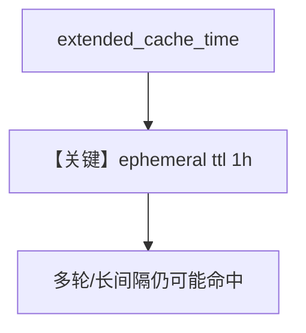

# prompt_caching_extended.py — 实现原理分析

> 源文件：`cookbook/90_models/anthropic/prompt_caching_extended.py`

## 概述

本示例在 **prompt 缓存** 基础上增加 **`betas=["extended-cache-ttl-2025-04-11"]`** 与 **`extended_cache_time=True`**，将缓存 TTL 延长至约 1 小时（以 Anthropic 文档为准）。

**核心配置一览：**

| 配置项 | 值 | 说明 |
|--------|------|------|
| `model` | `Claude(..., betas=[...], system_prompt=system_message, cache_system_prompt=True, extended_cache_time=True)` | 延长 TTL |
| `system_message` | 与 `Claude.system_prompt` 相同变量 | Agent 侧 system |

注：源码中 `Claude` 同时传入 `system_prompt` 与 `Agent(system_message=...)`；以框架实际解析为准（Anthropic Claude 类的 `system_prompt` 可能参与请求体，与 Agent 的 `system_message` 需避免语义重复——**以运行日志为准**）。

## 运行机制与因果链

1. **路径**：两次 `agent.run`，观察 `cache_write_tokens` / `cache_read_tokens`。
2. **与 `prompt_caching.py` 差异**：多 beta 与 `extended_cache_time`，适合跨轮次间隔更长的复用场景。

## System Prompt 组装

自定义 `system_message` 早退；内容来自本地 `system_promt.txt`（下载文件名）。

### 还原后的完整 System 文本

同 `prompt_caching.md`，需读本地文件全文，此处不重复。

## 完整 API 请求

`cache_control` 使用 `ttl: 1h` 当 `extended_cache_time` 为真（见 `claude.py` L531–534）。

## Mermaid 流程图

## 关键源码文件索引

| 文件 | 关键函数/类 | 作用 |
|------|------------|------|
| `agno/models/anthropic/claude.py` | `cache_system_prompt` / `extended_cache_time` | TTL 分支 |
