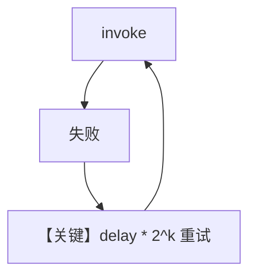

# retry.py — 实现原理分析

<!-- cookbook-py-source:start -->
## 完整源码

```python
"""Example demonstrating how to set up retries with Anthropic Claude."""

from agno.agent import Agent
from agno.models.anthropic import Claude

# ---------------------------------------------------------------------------
# Create Agent
# ---------------------------------------------------------------------------

# We will use a deliberately wrong model ID, to trigger retries.
wrong_model_id = "claude-wrong-id"

agent = Agent(
    model=Claude(
        id=wrong_model_id,
        retries=3,  # Number of times to retry the request.
        delay_between_retries=1,  # Delay between retries in seconds.
        exponential_backoff=True,  # If True, the delay between retries is doubled each time.
    ),
)

agent.print_response("What is the capital of France?")

# ---------------------------------------------------------------------------
# Run Agent
# ---------------------------------------------------------------------------

if __name__ == "__main__":
    pass
```

<!-- cookbook-py-source:end -->

> 源文件：`cookbook/90_models/anthropic/retry.py`

## 概述

本示例展示 **`Claude` 模型级重试**：故意使用错误 `id` 触发失败，依赖 **`retries` / `delay_between_retries` / `exponential_backoff`** 重试链路。

**核心配置一览：**

| 配置项 | 值 | 说明 |
|--------|------|------|
| `model` | `Claude(id="claude-wrong-id", retries=3, delay_between_retries=1, exponential_backoff=True)` | 重试策略 |
| `instructions` | 未设置 | 无 |

## 核心组件解析

重试在模型适配器或基类中包装 `invoke`；最终仍因非法 model id 失败（预期演示）。

### 运行机制与因果链

1. **路径**：`print_response` → 多次尝试 API → 仍报错或耗尽重试。
2. **副作用**：无持久化。
3. **定位**：与 `90_models/aws/retry` 等对照，展示 **Anthropic 适配器** 重试参数。

## System Prompt 组装

默认无 instructions；若 `markdown` 默认 False 则 system 可能极短或仅模型侧段落。

### 还原后的完整 System 文本

依 Agent 默认；可运行时打印。

## Mermaid 流程图



## 关键源码文件索引

| 文件 | 关键函数/类 | 作用 |
|------|------------|------|
| `agno/models/base` | 重试装饰/循环 | 依实现版本 |
