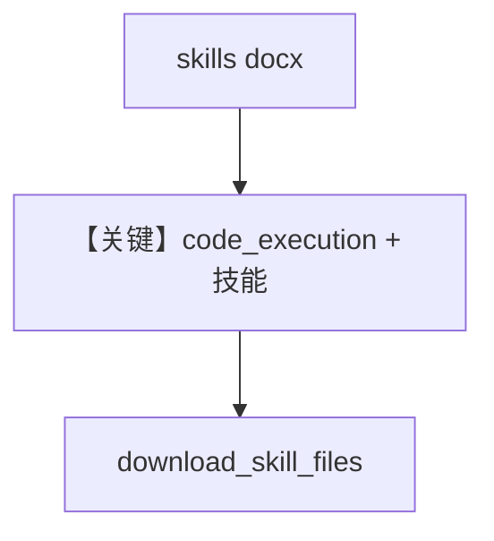

# agent_with_documents.py — 实现原理分析

> 源文件：`cookbook/90_models/anthropic/skills/agent_with_documents.py`

## 概述

本示例展示 **Claude Agent Skills（docx）**：在 `Claude` 上配置 `skills=[{"type":"anthropic","skill_id":"docx",...}]`，由模型通过代码执行/技能管线生成 Word，并用本地 **`file_download_helper.download_skill_files`** 从 `provider_data` 拉回文件。

**核心配置一览：**

| 配置项 | 值 | 说明 |
|--------|------|------|
| `name` | `"Document Creator"` | 可选，注入 name 相关 system 需 `add_name_to_context` 才进默认 system |
| `model` | `Claude(id="claude-sonnet-4-5-20250929", skills=[...])` | docx 技能 |
| `instructions` | 多行 list | 文档写作约束 |
| `markdown` | `True` | Markdown |

## 核心组件解析

### skills 与 code_execution

`claude.py` 中若 `self.skills` 非空会附加 `code_execution` 工具（见 L541–548），供技能生成文件。

### 运行机制与因果链

1. **路径**：`document_agent.run(prompt)` → 多轮 → `response.messages` 中 `provider_data` 含可下载文件引用。
2. **副作用**：本地写入下载的 docx。
3. **定位**：**单技能 docx**，与 xlsx/pptx 示例并列。

## System Prompt 组装

含多条 `instructions`；另含 skills 片段 `# 3.3.8.1`（若 `agent.skills` 提供 `get_system_prompt_snippet`）。

### 还原后的完整 System 文本（instructions 原样）

```text
You are a professional document writer with access to Word document skills.
Create well-structured documents with clear sections and professional formatting.
Use headings, lists, and tables where appropriate.
```

另含 Markdown 与 skills 动态段。

## Mermaid 流程图



## 关键源码文件索引

| 文件 | 关键函数/类 | 作用 |
|------|------------|------|
| `agno/models/anthropic/claude.py` | L541–548 skills | code_execution |
| `agno/agent/_messages.py` | `# 3.3.8.1` | skills 片段 |
