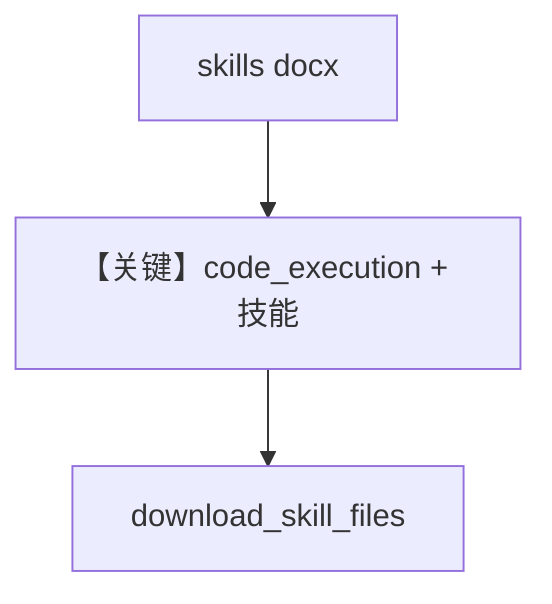

# agent_with_documents.py — 实现原理分析

<!-- cookbook-py-source:start -->
## 完整源码

```python
"""
Agno Agent with Word Document Skills.

This cookbook demonstrates how to use Claude's docx skill to create Word
documents through Agno agents.

Prerequisites:
- uv pip install agno anthropic
- export ANTHROPIC_API_KEY="your_api_key_here"
"""

import os

from agno.agent import Agent
from agno.models.anthropic import Claude
from anthropic import Anthropic
from file_download_helper import download_skill_files

# ---------------------------------------------------------------------------
# Create Agent
# ---------------------------------------------------------------------------

# Create a simple agent with Word document skills
document_agent = Agent(
    name="Document Creator",
    model=Claude(
        id="claude-sonnet-4-5-20250929",
        skills=[
            {"type": "anthropic", "skill_id": "docx", "version": "latest"}
        ],  # Enable Word document skill
    ),
    instructions=[
        "You are a professional document writer with access to Word document skills.",
        "Create well-structured documents with clear sections and professional formatting.",
        "Use headings, lists, and tables where appropriate.",
    ],
    markdown=True,
)

# ---------------------------------------------------------------------------
# Run Agent
# ---------------------------------------------------------------------------

if __name__ == "__main__":
    # Check for API key
    if not os.getenv("ANTHROPIC_API_KEY"):
        raise ValueError("ANTHROPIC_API_KEY environment variable not set")

    print("=" * 60)
    print("Agno Agent with Word Document Skills")
    print("=" * 60)

    # Example: Project proposal using the agent
    prompt = (
        "Create a project proposal document for 'Mobile App Development':\n\n"
        "Title: Mobile App Development Proposal\n\n"
        "1. Executive Summary:\n"
        "   Project to build a task management mobile app\n"
        "   Timeline: 12 weeks, Budget: $120K\n\n"
        "2. Project Overview:\n"
        "   - Native iOS and Android app\n"
        "   - Key features: Task lists, reminders, team collaboration\n"
        "   - Target users: Small business teams\n\n"
        "3. Scope of Work:\n"
        "   - Requirements gathering (Week 1-2)\n"
        "   - Design and prototyping (Week 3-4)\n"
        "   - Development (Week 5-10)\n"
        "   - Testing and launch (Week 11-12)\n\n"
        "4. Team:\n"
        "   - 2 developers, 1 designer, 1 project manager\n\n"
        "5. Budget Breakdown:\n"
        "   - Development: $80K\n"
        "   - Design: $25K\n"
        "   - Testing: $10K\n"
        "   - Contingency: $5K\n\n"
        "6. Success Metrics:\n"
        "   - 1000 users in first month\n"
        "   - 4.5+ star rating\n"
        "   - 70% user retention\n\n"
        "Save as 'mobile_app_proposal.docx'"
    )

    print("\nCreating document...\n")

    # Use the agent to create the document
    response = document_agent.run(prompt)

    # Print the agent's response
    print(response.content)

    # Download files created by the agent
    print("\n" + "=" * 60)
    print("Downloading files...")
    print("=" * 60)

    client = Anthropic(api_key=os.getenv("ANTHROPIC_API_KEY"))

    # Download files from the agent's response
    if response.messages:
        for msg in response.messages:
            if hasattr(msg, "provider_data") and msg.provider_data:
                files = download_skill_files(
                    msg.provider_data,
                    client,
                    default_filename="mobile_app_proposal.docx",
                )
                if files:
                    print(f"\n Successfully downloaded {len(files)} file(s):")
                    for file in files:
                        print(f"   - {file}")
                    break
    else:
        print("\n  No files were downloaded")

    print("\n" + "=" * 60)
    print("Done! Check the current directory for your files.")
    print("=" * 60)
```

<!-- cookbook-py-source:end -->

> 源文件：`cookbook/90_models/anthropic/skills/agent_with_documents.py`

## 概述

本示例展示 **Claude Agent Skills（docx）**：在 `Claude` 上配置 `skills=[{"type":"anthropic","skill_id":"docx",...}]`，由模型通过代码执行/技能管线生成 Word，并用本地 **`file_download_helper.download_skill_files`** 从 `provider_data` 拉回文件。

**核心配置一览：**

| 配置项 | 值 | 说明 |
|--------|------|------|
| `name` | `"Document Creator"` | 可选，注入 name 相关 system 需 `add_name_to_context` 才进默认 system |
| `model` | `Claude(id="claude-sonnet-4-5-20250929", skills=[...])` | docx 技能 |
| `instructions` | 多行 list | 文档写作约束 |
| `markdown` | `True` | Markdown |

## 核心组件解析

### skills 与 code_execution

`claude.py` 中若 `self.skills` 非空会附加 `code_execution` 工具（见 L541–548），供技能生成文件。

### 运行机制与因果链

1. **路径**：`document_agent.run(prompt)` → 多轮 → `response.messages` 中 `provider_data` 含可下载文件引用。
2. **副作用**：本地写入下载的 docx。
3. **定位**：**单技能 docx**，与 xlsx/pptx 示例并列。

## System Prompt 组装

含多条 `instructions`；另含 skills 片段 `# 3.3.8.1`（若 `agent.skills` 提供 `get_system_prompt_snippet`）。

### 还原后的完整 System 文本（instructions 原样）

```text
You are a professional document writer with access to Word document skills.
Create well-structured documents with clear sections and professional formatting.
Use headings, lists, and tables where appropriate.
```

另含 Markdown 与 skills 动态段。

## Mermaid 流程图



## 关键源码文件索引

| 文件 | 关键函数/类 | 作用 |
|------|------------|------|
| `agno/models/anthropic/claude.py` | L541–548 skills | code_execution |
| `agno/agent/_messages.py` | `# 3.3.8.1` | skills 片段 |
