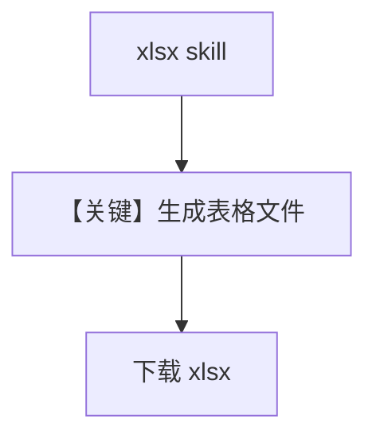

# agent_with_excel.py — 实现原理分析

> 源文件：`cookbook/90_models/anthropic/skills/agent_with_excel.py`

## 概述

本示例展示 **xlsx 技能**：`skill_id` 为 `xlsx`，生成 Excel 并通过 `download_skill_files` 下载 `sales_dashboard.xlsx`。

**核心配置一览：**

| 配置项 | 值 | 说明 |
|--------|------|------|
| `name` | `"Excel Creator"` | Agent 名 |
| `model` | `Claude(..., skills=[{"skill_id":"xlsx",...}])` | Excel 技能 |
| `instructions` | 数据分析与表格约束 | list |
| `markdown` | `True` | Markdown |

## System Prompt 组装

### 还原后的完整 System 文本（instructions 原样）

```text
You are a data analysis specialist with access to Excel skills.
Create professional spreadsheets with well-formatted tables and accurate formulas.
Use charts and visualizations to make data insights clear.
```

## 运行机制与因果链

与 `agent_with_documents.md` 相同机制，仅技能 id 与业务 prompt 不同。

## Mermaid 流程图



## 关键源码文件索引

| 文件 | 关键函数/类 | 作用 |
|------|------------|------|
| `agno/models/anthropic/claude.py` | `skills` / code_execution | 与 documents 相同 |
