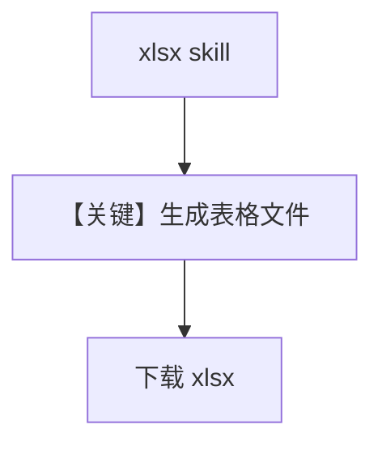

# agent_with_excel.py — 实现原理分析

<!-- cookbook-py-source:start -->
## 完整源码

```python
"""
Agno Agent with Excel Skills.

This cookbook demonstrates how to use Claude's xlsx skill to create Excel
spreadsheets through Agno agents.

Prerequisites:
- uv pip install agno anthropic
- export ANTHROPIC_API_KEY="your_api_key_here"
"""

import os

from agno.agent import Agent
from agno.models.anthropic import Claude
from anthropic import Anthropic
from file_download_helper import download_skill_files

# ---------------------------------------------------------------------------
# Create Agent
# ---------------------------------------------------------------------------

# Create a simple agent with Excel skills
excel_agent = Agent(
    name="Excel Creator",
    model=Claude(
        id="claude-sonnet-4-5-20250929",
        skills=[
            {"type": "anthropic", "skill_id": "xlsx", "version": "latest"}
        ],  # Enable Excel spreadsheet skill
    ),
    instructions=[
        "You are a data analysis specialist with access to Excel skills.",
        "Create professional spreadsheets with well-formatted tables and accurate formulas.",
        "Use charts and visualizations to make data insights clear.",
    ],
    markdown=True,
)

# ---------------------------------------------------------------------------
# Run Agent
# ---------------------------------------------------------------------------

if __name__ == "__main__":
    # Check for API key
    if not os.getenv("ANTHROPIC_API_KEY"):
        raise ValueError("ANTHROPIC_API_KEY environment variable not set")

    print("=" * 60)
    print("Agno Agent with Excel Skills")
    print("=" * 60)

    # Example: Sales dashboard using the agent
    prompt = (
        "Create a sales dashboard for January 2026 with:\n"
        "Sales data for 5 reps:\n"
        "- Alice: 24 deals, $385K revenue, 65% close rate\n"
        "- Bob: 19 deals, $298K revenue, 58% close rate\n"
        "- Carol: 31 deals, $467K revenue, 72% close rate\n"
        "- David: 22 deals, $356K revenue, 61% close rate\n"
        "- Emma: 27 deals, $412K revenue, 68% close rate\n\n"
        "Include:\n"
        "1. Table with all metrics\n"
        "2. Total revenue calculation\n"
        "3. Bar chart showing revenue by rep\n"
        "4. Quota attainment (quota: $350K per rep)\n"
        "5. Conditional formatting (green if above quota, red if below)\n"
        "Save as 'sales_dashboard.xlsx'"
    )

    print("\nCreating spreadsheet...\n")

    # Use the agent to create the spreadsheet
    response = excel_agent.run(prompt)

    # Print the agent's response
    print(response.content)

    # Download files created by the agent
    print("\n" + "=" * 60)
    print("Downloading files...")
    print("=" * 60)

    # Access the underlying response to get file IDs
    client = Anthropic(api_key=os.getenv("ANTHROPIC_API_KEY"))

    # Download files from the agent's response
    if response.messages:
        for msg in response.messages:
            if hasattr(msg, "provider_data") and msg.provider_data:
                files = download_skill_files(
                    msg.provider_data, client, default_filename="sales_dashboard.xlsx"
                )
                if files:
                    print(f"\n Successfully downloaded {len(files)} file(s):")
                    for file in files:
                        print(f"   - {file}")
                    break
    else:
        print("\n  No files were downloaded")

    print("\n" + "=" * 60)
    print("Done! Check the current directory for your files.")
    print("=" * 60)
```

<!-- cookbook-py-source:end -->

> 源文件：`cookbook/90_models/anthropic/skills/agent_with_excel.py`

## 概述

本示例展示 **xlsx 技能**：`skill_id` 为 `xlsx`，生成 Excel 并通过 `download_skill_files` 下载 `sales_dashboard.xlsx`。

**核心配置一览：**

| 配置项 | 值 | 说明 |
|--------|------|------|
| `name` | `"Excel Creator"` | Agent 名 |
| `model` | `Claude(..., skills=[{"skill_id":"xlsx",...}])` | Excel 技能 |
| `instructions` | 数据分析与表格约束 | list |
| `markdown` | `True` | Markdown |

## System Prompt 组装

### 还原后的完整 System 文本（instructions 原样）

```text
You are a data analysis specialist with access to Excel skills.
Create professional spreadsheets with well-formatted tables and accurate formulas.
Use charts and visualizations to make data insights clear.
```

## 运行机制与因果链

与 `agent_with_documents.md` 相同机制，仅技能 id 与业务 prompt 不同。

## Mermaid 流程图



## 关键源码文件索引

| 文件 | 关键函数/类 | 作用 |
|------|------------|------|
| `agno/models/anthropic/claude.py` | `skills` / code_execution | 与 documents 相同 |
