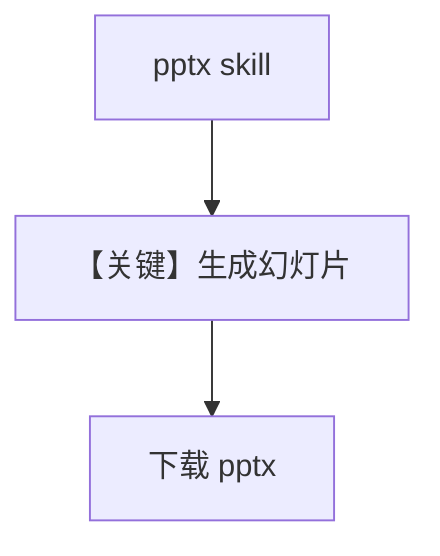

# agent_with_powerpoint.py — 实现原理分析

> 源文件：`cookbook/90_models/anthropic/skills/agent_with_powerpoint.py`

## 概述

本示例展示 **pptx 技能**：生成 PowerPoint 并下载 `q4_review.pptx`。

**核心配置一览：**

| 配置项 | 值 | 说明 |
|--------|------|------|
| `name` | `"PowerPoint Creator"` | Agent 名 |
| `model` | `Claude(..., skills=[{"skill_id":"pptx",...}])` | 演示文稿技能 |
| `instructions` | 演示文稿约束 | list |
| `markdown` | `True` | Markdown |

## System Prompt 组装

### 还原后的完整 System 文本（instructions 原样）

```text
You are a professional presentation creator with access to PowerPoint skills.
Create well-structured presentations with clear slides and professional design.
Keep text concise - no more than 6 bullet points per slide.
```

## Mermaid 流程图



## 关键源码文件索引

| 文件 | 关键函数/类 | 作用 |
|------|------------|------|
| `agno/models/anthropic/claude.py` | `skills` | 同系列 |
