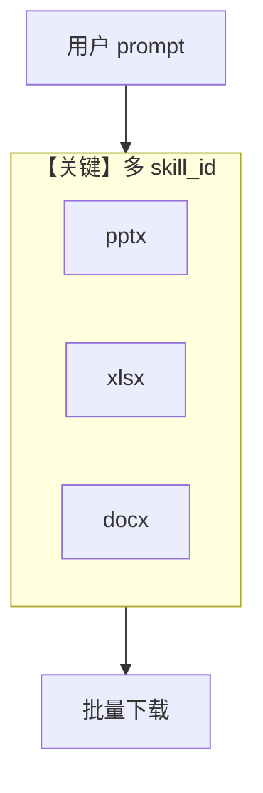

# multi_skill_agent.py — 实现原理分析

<!-- cookbook-py-source:start -->
## 完整源码

```python
"""
Multi-Skill Agent - PowerPoint, Excel, and Word.

This cookbook demonstrates how to create an agent with multiple Claude Agent Skills
that can create presentations, spreadsheets, and documents in a single workflow.

Prerequisites:
- uv pip install agno anthropic
- export ANTHROPIC_API_KEY="your_api_key_here"
"""

import os

from agno.agent import Agent
from agno.models.anthropic import Claude
from anthropic import Anthropic
from file_download_helper import download_skill_files

# ---------------------------------------------------------------------------
# Create Agent
# ---------------------------------------------------------------------------

# Create an agent with multiple skills
multi_skill_agent = Agent(
    name="Multi-Skill Document Creator",
    model=Claude(
        id="claude-sonnet-4-5-20250929",
        skills=[
            {"type": "anthropic", "skill_id": "pptx", "version": "latest"},
            {"type": "anthropic", "skill_id": "xlsx", "version": "latest"},
            {"type": "anthropic", "skill_id": "docx", "version": "latest"},
        ],  # Enable PowerPoint, Excel, and Word skills
    ),
    instructions=[
        "You are a comprehensive business document creator.",
        "You have access to PowerPoint, Excel, and Word document skills.",
        "Create professional document packages with consistent information across all files.",
    ],
    markdown=True,
)

# ---------------------------------------------------------------------------
# Run Agent
# ---------------------------------------------------------------------------

if __name__ == "__main__":
    # Check for API key
    if not os.getenv("ANTHROPIC_API_KEY"):
        raise ValueError("ANTHROPIC_API_KEY environment variable not set")

    print("=" * 60)
    print("Multi-Skill Agent - Document Package Creation")
    print("=" * 60)

    # Example: Create a simple multi-skill document package
    prompt = (
        "Create a sales report package with 2 documents:\n\n"
        "1. EXCEL SPREADSHEET (sales_report.xlsx):\n"
        "   - Q4 sales data: Oct $450K, Nov $520K, Dec $610K\n"
        "   - Include a total formula\n"
        "   - Add a simple bar chart\n\n"
        "2. WORD DOCUMENT (sales_summary.docx):\n"
        "   - Brief Q4 sales summary\n"
        "   - Total sales: $1.58M\n"
        "   - Growth trend: Strong December performance\n"
    )

    print("\nCreating document package...\n")

    # Use the agent to create all documents
    response = multi_skill_agent.run(prompt)

    # Print the agent's response
    print(response.content)

    # Download files created by the agent
    print("\n" + "=" * 60)
    print("Downloading files...")
    print("=" * 60)

    # Access the underlying response to get file IDs
    client = Anthropic(api_key=os.getenv("ANTHROPIC_API_KEY"))

    # Download files from the agent's response
    if response.messages:
        for msg in response.messages:
            if hasattr(msg, "provider_data") and msg.provider_data:
                files = download_skill_files(msg.provider_data, client)
                if files:
                    print(f"\n Successfully downloaded {len(files)} file(s):")
                    for file in files:
                        print(f"   - {file}")
                    break
    else:
        print("\n  No files were downloaded")

    print("\n" + "=" * 60)
    print("Done! Check the current directory for all files.")
    print("=" * 60)
```

<!-- cookbook-py-source:end -->

> 源文件：`cookbook/90_models/anthropic/skills/multi_skill_agent.py`

## 概述

本示例在 **单个 Agent** 上同时启用 **pptx、xlsx、docx** 三种技能，一次对话产出多类办公文件。

**核心配置一览：**

| 配置项 | 值 | 说明 |
|--------|------|------|
| `name` | `"Multi-Skill Document Creator"` | Agent 名 |
| `model` | `Claude(..., skills=[pptx, xlsx, docx])` | 多技能 |
| `instructions` | 综合文档包说明 | list |
| `markdown` | `True` | Markdown |

## 运行机制与因果链

1. **路径**：单 `run` 可能触发多个技能与多次文件产出；`download_skill_files` 遍历 `provider_data`。
2. **与单技能示例差异**：**编排多格式输出**，对提示词要求更高。

## System Prompt 组装

### 还原后的完整 System 文本（instructions 原样）

```text
You are a comprehensive business document creator.
You have access to PowerPoint, Excel, and Word document skills.
Create professional document packages with consistent information across all files.
```

## Mermaid 流程图



## 关键源码文件索引

| 文件 | 关键函数/类 | 作用 |
|------|------------|------|
| `agno/models/anthropic/claude.py` | `skills` 列表 | 多技能注册 |
