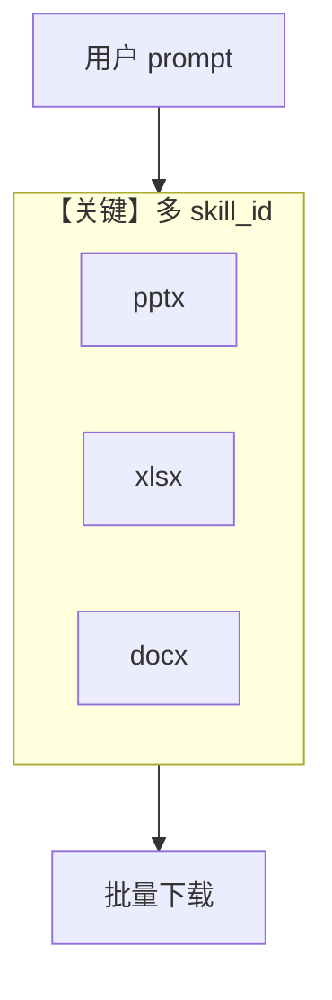

# multi_skill_agent.py — 实现原理分析

> 源文件：`cookbook/90_models/anthropic/skills/multi_skill_agent.py`

## 概述

本示例在 **单个 Agent** 上同时启用 **pptx、xlsx、docx** 三种技能，一次对话产出多类办公文件。

**核心配置一览：**

| 配置项 | 值 | 说明 |
|--------|------|------|
| `name` | `"Multi-Skill Document Creator"` | Agent 名 |
| `model` | `Claude(..., skills=[pptx, xlsx, docx])` | 多技能 |
| `instructions` | 综合文档包说明 | list |
| `markdown` | `True` | Markdown |

## 运行机制与因果链

1. **路径**：单 `run` 可能触发多个技能与多次文件产出；`download_skill_files` 遍历 `provider_data`。
2. **与单技能示例差异**：**编排多格式输出**，对提示词要求更高。

## System Prompt 组装

### 还原后的完整 System 文本（instructions 原样）

```text
You are a comprehensive business document creator.
You have access to PowerPoint, Excel, and Word document skills.
Create professional document packages with consistent information across all files.
```

## Mermaid 流程图



## 关键源码文件索引

| 文件 | 关键函数/类 | 作用 |
|------|------------|------|
| `agno/models/anthropic/claude.py` | `skills` 列表 | 多技能注册 |
