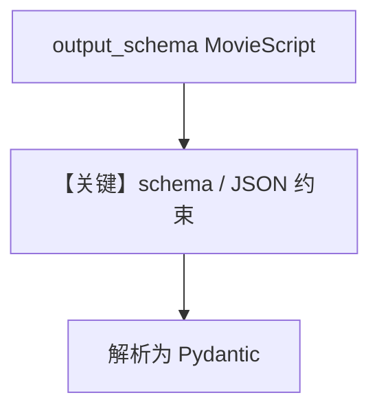

# structured_output.py — 实现原理分析

<!-- cookbook-py-source:start -->
## 完整源码

```python
"""
Anthropic Structured Output
===========================

Cookbook example for `anthropic/structured_output.py`.
"""

from typing import List

from agno.agent import Agent, RunOutput  # noqa
from agno.models.anthropic import Claude
from pydantic import BaseModel, Field
from rich.pretty import pprint  # noqa

# ---------------------------------------------------------------------------
# Create Agent
# ---------------------------------------------------------------------------


class MovieScript(BaseModel):
    setting: str = Field(
        ..., description="Provide a nice setting for a blockbuster movie."
    )
    ending: str = Field(
        ...,
        description="Ending of the movie. If not available, provide a happy ending.",
    )
    genre: str = Field(
        ...,
        description="Genre of the movie. If not available, select action, thriller or romantic comedy.",
    )
    name: str = Field(..., description="Give a name to this movie")
    characters: List[str] = Field(..., description="Name of characters for this movie.")
    storyline: str = Field(
        ..., description="3 sentence storyline for the movie. Make it exciting!"
    )


movie_agent = Agent(
    model=Claude(id="claude-opus-4-5-20251101"),
    description="You help people write movie scripts.",
    output_schema=MovieScript,
)

# You can also get the response in a variable:
# run: RunOutput = movie_agent.run("New York")

# ---------------------------------------------------------------------------
# Run Agent
# ---------------------------------------------------------------------------
if __name__ == "__main__":
    # --- Sync ---
    movie_agent.print_response("New York")

    # --- Sync + Streaming ---
    movie_agent.print_response("New York", stream=True)
```

<!-- cookbook-py-source:end -->

> 源文件：`cookbook/90_models/anthropic/structured_output.py`

## 概述

本示例展示 **`output_schema=MovieScript`**（Pydantic）与 **`description`**：Claude 在支持原生/模式化输出时返回结构化内容；示例中 **`print_response` 与流式** 演示多种调用方式。

**核心配置一览：**

| 配置项 | 值 | 说明 |
|--------|------|------|
| `model` | `Claude(id="claude-opus-4-5-20251101")` | 结构化输出能力依模型 |
| `description` | `"You help people write movie scripts."` | 进入 system `# 3.3.1` |
| `output_schema` | `MovieScript` | 触发 schema / JSON 提示或原生 output_format |

## System Prompt 组装

含 `description`；有 `output_schema` 时 **`markdown` 默认不追加**「Use markdown...」（`_messages.py` `# 3.2.1` 条件含 `output_schema is None`）。

### 还原后的完整 System 文本（核心字面量）

```text
You help people write movie scripts.
```

另含 `get_json_output_prompt` / `output_format` 相关段（依模型是否原生结构化），需运行时确认。

## 运行机制与因果链

1. **路径**：`output_schema` → `_messages.py` `# 3.3.15`–`# 3.3.16` 可能追加 JSON/schema 提示 → Claude `output_format` 或解析。
2. **定位**：**剧本结构化字段** 的典型演示。

## Mermaid 流程图



## 关键源码文件索引

| 文件 | 关键函数/类 | 作用 |
|------|------------|------|
| `agno/agent/_messages.py` | `# 3.3.15`–`# 3.3.16` | JSON 提示 |
| `agno/models/anthropic/claude.py` | `_build_output_format` | output_format |
