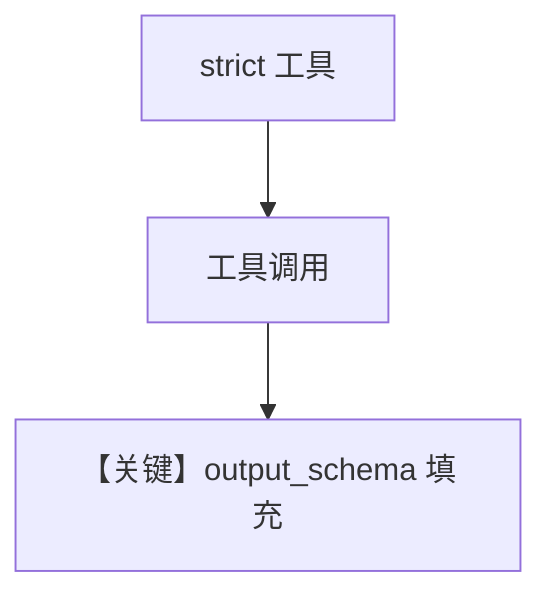

# structured_output_strict_tools.py — 实现原理分析

<!-- cookbook-py-source:start -->
## 完整源码

```python
"""Example demonstrating strict tool use with Anthropic structured outputs.

Strict tool use ensures that tool parameters strictly follow the input_schema.
"""

from agno.agent import Agent
from agno.models.anthropic import Claude
from agno.tools import Function
from pydantic import BaseModel

# ---------------------------------------------------------------------------
# Create Agent
# ---------------------------------------------------------------------------


class WeatherInfo(BaseModel):
    """Structured output schema for weather information."""

    location: str
    temperature: float
    unit: str
    condition: str


def get_weather(location: str, unit: str = "celsius") -> str:
    temp = 72 if unit == "fahrenheit" else 22
    return f"Weather in {location}: {temp}°{unit}, Sunny"


# Create function with strict mode enabled
weather_tool = Function(
    name="get_weather",
    description="Get current weather information for a location",
    parameters={
        "type": "object",
        "properties": {
            "location": {
                "type": "string",
                "description": "The city and state, e.g. San Francisco, CA",
            },
            "unit": {
                "type": "string",
                "enum": ["celsius", "fahrenheit"],
                "description": "Temperature unit",
            },
        },
        "required": ["location"],
        "additionalProperties": False,
    },
    strict=True,  # Enable strict mode for validated tool parameters
    entrypoint=get_weather,
)

# Agent with both structured outputs and strict tool
agent = Agent(
    model=Claude(id="claude-sonnet-4-5-20250929"),
    tools=[weather_tool],
    output_schema=WeatherInfo,
    description="You help users get weather information.",
)

# The agent will use strict tool validation and return structured output
agent.print_response("What's the weather like in San Francisco?")

# ---------------------------------------------------------------------------
# Run Agent
# ---------------------------------------------------------------------------

if __name__ == "__main__":
    pass
```

<!-- cookbook-py-source:end -->

> 源文件：`cookbook/90_models/anthropic/structured_output_strict_tools.py`

## 概述

本示例同时演示 **`Function(..., strict=True)`** 严格工具参数与 **`output_schema=WeatherInfo`**：工具 schema 附加 `additionalProperties: False` 等，与结构化最终输出并存。

**核心配置一览：**

| 配置项 | 值 | 说明 |
|--------|------|------|
| `model` | `Claude(id="claude-sonnet-4-5-20250929")` | 工具 + 结构化 |
| `tools` | `[weather_tool]` | strict 工具 |
| `output_schema` | `WeatherInfo` | 结构化响应 |
| `description` | `"You help users get weather information."` | system |

## 核心组件解析

### strict Function

`agno` 将 strict 工具交给 `format_tools_for_model`，Claude 侧校验参数形状。

## System Prompt 组装

### 还原后的完整 System 文本（片段）

```text
You help users get weather information.
```

另含工具说明与 JSON/schema 段（动态）。

## Mermaid 流程图



## 关键源码文件索引

| 文件 | 关键函数/类 | 作用 |
|------|------------|------|
| `agno/tools/function.py` | `Function` | strict |
| `agno/models/anthropic/claude.py` | `format_tools_for_model` | 工具格式 |
