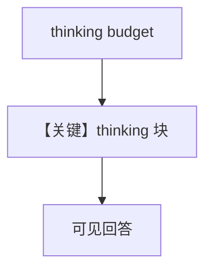

# thinking.py — 实现原理分析

> 源文件：`cookbook/90_models/anthropic/thinking.py`

## 概述

本示例展示 **Claude thinking** 参数与 **`max_tokens`**：启用模型内部思考块再输出用户可见正文。

**核心配置一览：**

| 配置项 | 值 | 说明 |
|--------|------|------|
| `model` | `Claude(id="claude-3-7-sonnet-20250219", max_tokens=2048, thinking={...})` | thinking budget |
| `markdown` | `True` | Markdown |

## 运行机制与因果链

请求体含 thinking 配置；流式时可先看到 thinking 再看到文本（依 SDK）。

## System Prompt 组装

### 还原后的完整 System 文本

```text
Use markdown to format your answers.
```

## Mermaid 流程图



## 关键源码文件索引

| 文件 | 关键函数/类 | 作用 |
|------|------------|------|
| `agno/models/anthropic/claude.py` | `_prepare_request_kwargs` | thinking 合并 |
