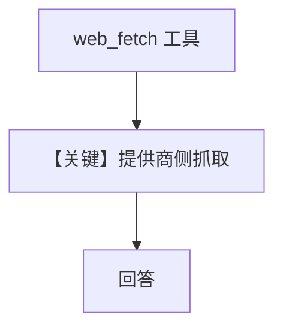

# web_fetch.py — 实现原理分析

> 源文件：`cookbook/90_models/anthropic/web_fetch.py`

## 概述

本示例展示 **Anthropic 原生 `web_fetch` 工具字典**（非 agno `WebSearchTools`），通过 **`betas=["web-fetch-2025-09-10"]`** 启用。

**核心配置一览：**

| 配置项 | 值 | 说明 |
|--------|------|------|
| `model` | `Claude(id="claude-opus-4-5", betas=[...])` | beta |
| `tools` | `[{"type":"web_fetch_20250910",...}]` | 原生抓取工具 |
| `markdown` | `True` | Markdown |

## 运行机制与因果链

工具 schema 直接传给 Anthropic；模型按需抓取 URL 内容。

## System Prompt 组装

### 还原后的完整 System 文本

```text
Use markdown to format your answers.
```

## Mermaid 流程图



## 关键源码文件索引

| 文件 | 关键函数/类 | 作用 |
|------|------------|------|
| `agno/models/anthropic/claude.py` | `format_tools_for_model` | 透传工具 |
