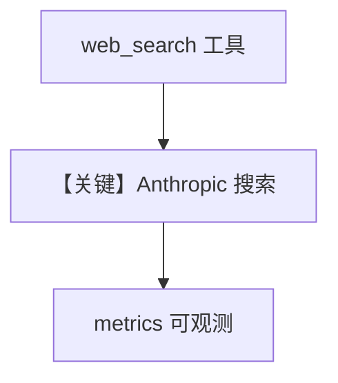

# web_search.py — 实现原理分析

> 源文件：`cookbook/90_models/anthropic/web_search.py`

## 概述

本示例展示 **Anthropic 原生 `web_search` 工具** 与 **`InMemoryDb()`**：记录会话同时用 **`web_search_20250305`** 类型工具。

**核心配置一览：**

| 配置项 | 值 | 说明 |
|--------|------|------|
| `model` | `Claude(id="claude-sonnet-4-20250514")` | beta 工具路径 |
| `db` | `InMemoryDb()` | 内存会话存储 |
| `tools` | `[{"type":"web_search_20250305",...}]` | 原生搜索 |
| `markdown` | `True` | Markdown |

## 运行机制与因果链

`get_last_run_output().metrics` 可含 web 搜索用量；`InMemoryDb` 便于无 Postgres 时跑通示例。

## System Prompt 组装

### 还原后的完整 System 文本

```text
Use markdown to format your answers.
```

## Mermaid 流程图



## 关键源码文件索引

| 文件 | 关键函数/类 | 作用 |
|------|------------|------|
| `agno/db/in_memory.py` | `InMemoryDb` | 会话 |
| `agno/models/anthropic/claude.py` | `invoke` | 请求 |
