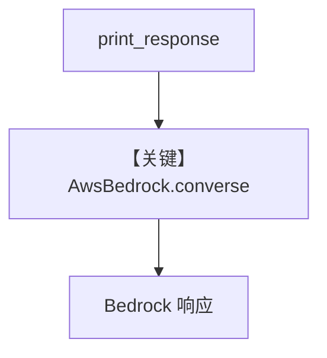

# basic.py — 实现原理分析

> 源文件：`cookbook/90_models/aws/bedrock/basic.py`

## 概述

本示例展示 **`AwsBedrock`** 与 Agent 的 **同步/流式/异步** 调用，模型为 **Claude Haiku** 的 Bedrock ID。

**核心配置一览：**

| 配置项 | 值 | 说明 |
|--------|------|------|
| `model` | `AwsBedrock(id="us.anthropic.claude-3-5-haiku-20241022-v1:0")` | Bedrock Converse API |
| `markdown` | `True` | 默认 system 含 Markdown 说明 |

## 架构分层

`Agent` → `AwsBedrock.invoke` → `bedrock.py` `get_client().converse(modelId=..., messages=..., system=...)`（L510）。

## 核心组件解析

### Bedrock Converse

与 Anthropic 直连不同，使用 AWS SDK **`converse`**，body 含 `system`、`toolConfig`、`inferenceConfig`（`bedrock.py` L498–510）。

### 运行机制与因果链

1. **路径**：无工具时单次往返。
2. **副作用**：需 AWS 凭证与 Bedrock 权限。
3. **定位**：**Bedrock 入口**最简示例。

## System Prompt 组装

### 还原后的完整 System 文本

```text
Use markdown to format your answers.
```

## 完整 API 请求

```python
# bedrock.py L510 附近
# client.converse(modelId=self.id, messages=formatted_messages, system=system_message, ...)
```

## Mermaid 流程图



## 关键源码文件索引

| 文件 | 关键函数/类 | 作用 |
|------|------------|------|
| `agno/models/aws/bedrock.py` | `invoke()` L478–515 | Converse |
| `agno/agent/_messages.py` | `get_system_message()` | system 文本 |
