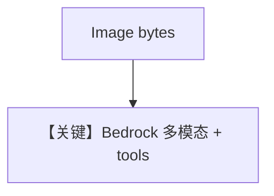

# image_agent_bytes.md — 实现原理分析

> 源文件：`cookbook/90_models/aws/bedrock/image_agent_bytes.py`

## 概述

本示例展示 **Nova Pro**（`amazon.nova-pro-v1:0`）在 Bedrock 上的 **图像 bytes + WebSearchTools**。

**核心配置一览：**

| 配置项 | 值 | 说明 |
|--------|------|------|
| `model` | `AwsBedrock(id="amazon.nova-pro-v1:0")` | 多模态 Nova |
| `tools` | `[WebSearchTools()]` | 搜索 |
| `markdown` | `True` | Markdown |
| `images` | `Image(content=..., format="jpeg")` | 字节 |

## 运行机制与因果链

`converse` 请求的 messages 含图像块；工具循环由 Agent 驱动。

## System Prompt 组装

### 还原后的完整 System 文本

```text
Use markdown to format your answers.
```

## Mermaid 流程图



## 关键源码文件索引

| 文件 | 关键函数/类 | 作用 |
|------|------------|------|
| `agno/models/aws/bedrock.py` | `_format_messages` / `invoke` | 媒体与 Converse |
