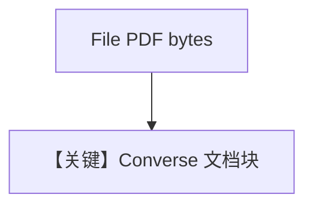

# pdf_agent_bytes.py — 实现原理分析

<!-- cookbook-py-source:start -->
## 完整源码

```python
"""
Aws Pdf Agent Bytes
===================

Cookbook example for `aws/bedrock/pdf_agent_bytes.py`.
"""

from pathlib import Path

from agno.agent import Agent
from agno.media import File
from agno.models.aws import AwsBedrock
from agno.utils.media import download_file

# ---------------------------------------------------------------------------
# Create Agent
# ---------------------------------------------------------------------------

pdf_path = Path(__file__).parent.joinpath("ThaiRecipes.pdf")

download_file(
    "https://agno-public.s3.amazonaws.com/recipes/ThaiRecipes.pdf", str(pdf_path)
)

agent = Agent(
    model=AwsBedrock(id="amazon.nova-pro-v1:0"),
    markdown=True,
)

pdf_bytes = pdf_path.read_bytes()

agent.print_response(
    "Give the recipe of Gaeng Kiew Wan Goong",
    files=[File(content=pdf_bytes, format="pdf", name="Thai Recipes")],
)

# ---------------------------------------------------------------------------
# Run Agent
# ---------------------------------------------------------------------------

if __name__ == "__main__":
    pass
```

<!-- cookbook-py-source:end -->

> 源文件：`cookbook/90_models/aws/bedrock/pdf_agent_bytes.py`

## 概述

本示例展示 **PDF 字节** 作为 `File` 传入 **Nova Pro** Bedrock，用于抽取菜谱信息。

**核心配置一览：**

| 配置项 | 值 | 说明 |
|--------|------|------|
| `model` | `AwsBedrock(id="amazon.nova-pro-v1:0")` | 文档理解 |
| `markdown` | `True` | Markdown |
| `files` | `File(content=..., format="pdf", name="Thai Recipes")` | PDF 字节 |

## System Prompt 组装

### 还原后的完整 System 文本

```text
Use markdown to format your answers.
```

## Mermaid 流程图



## 关键源码文件索引

| 文件 | 关键函数/类 | 作用 |
|------|------------|------|
| `agno/models/aws/bedrock.py` | `invoke()` | Converse |
