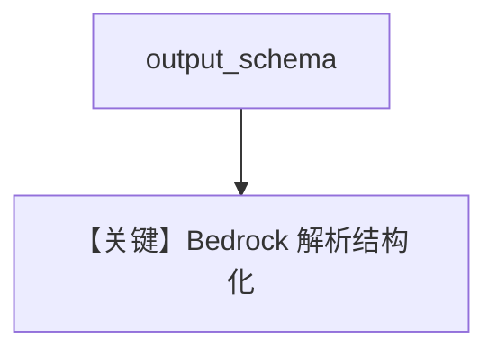

# structured_output.py — 实现原理分析

> 源文件：`cookbook/90_models/aws/bedrock/structured_output.py`

## 概述

本示例展示 **AwsBedrock** 上的 **`output_schema=MovieScript`** 与 **`description`**，模型为 Haiku。

**核心配置一览：**

| 配置项 | 值 | 说明 |
|--------|------|------|
| `model` | `AwsBedrock(id="us.anthropic.claude-3-5-haiku-20241022-v1:0")` | Bedrock |
| `description` | `"You help people write movie scripts."` | system |
| `output_schema` | `MovieScript` | 结构化输出 |

## System Prompt 组装

含 description；有 `output_schema` 时通常不再追加「Use markdown...」。

### 还原后的完整 System 文本（核心）

```text
You help people write movie scripts.
```

## Mermaid 流程图



## 关键源码文件索引

| 文件 | 关键函数/类 | 作用 |
|------|------------|------|
| `agno/models/aws/bedrock.py` | `_parse_provider_response` | 结构化 |
