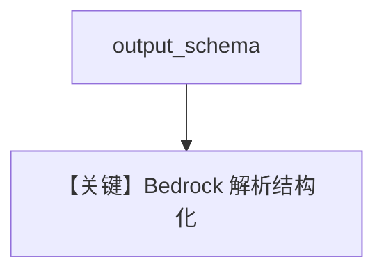

# structured_output.py — 实现原理分析

<!-- cookbook-py-source:start -->
## 完整源码

```python
"""
Aws Structured Output
=====================

Cookbook example for `aws/bedrock/structured_output.py`.
"""

from typing import List

from agno.agent import Agent, RunOutput  # noqa
from agno.models.aws import AwsBedrock
from pydantic import BaseModel, Field
from rich.pretty import pprint  # noqa

# ---------------------------------------------------------------------------
# Create Agent
# ---------------------------------------------------------------------------


class MovieScript(BaseModel):
    setting: str = Field(
        ..., description="Provide a nice setting for a blockbuster movie."
    )
    ending: str = Field(
        ...,
        description="Ending of the movie. If not available, provide a happy ending.",
    )
    genre: str = Field(
        ...,
        description="Genre of the movie. If not available, select action, thriller or romantic comedy.",
    )
    name: str = Field(..., description="Give a name to this movie")
    characters: List[str] = Field(..., description="Name of characters for this movie.")
    storyline: str = Field(
        ..., description="3 sentence storyline for the movie. Make it exciting!"
    )


movie_agent = Agent(
    model=AwsBedrock(id="us.anthropic.claude-3-5-haiku-20241022-v1:0"),
    description="You help people write movie scripts.",
    output_schema=MovieScript,
)

# Get the response in a variable
# movie_agent: RunOutput = movie_agent.run("New York")
# pprint(movie_agent.content)

movie_agent.print_response("New York")

# ---------------------------------------------------------------------------
# Run Agent
# ---------------------------------------------------------------------------

if __name__ == "__main__":
    pass
```

<!-- cookbook-py-source:end -->

> 源文件：`cookbook/90_models/aws/bedrock/structured_output.py`

## 概述

本示例展示 **AwsBedrock** 上的 **`output_schema=MovieScript`** 与 **`description`**，模型为 Haiku。

**核心配置一览：**

| 配置项 | 值 | 说明 |
|--------|------|------|
| `model` | `AwsBedrock(id="us.anthropic.claude-3-5-haiku-20241022-v1:0")` | Bedrock |
| `description` | `"You help people write movie scripts."` | system |
| `output_schema` | `MovieScript` | 结构化输出 |

## System Prompt 组装

含 description；有 `output_schema` 时通常不再追加「Use markdown...」。

### 还原后的完整 System 文本（核心）

```text
You help people write movie scripts.
```

## Mermaid 流程图



## 关键源码文件索引

| 文件 | 关键函数/类 | 作用 |
|------|------------|------|
| `agno/models/aws/bedrock.py` | `_parse_provider_response` | 结构化 |
