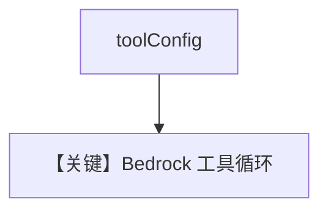

# tool_use.py — 实现原理分析

> 源文件：`cookbook/90_models/aws/bedrock/tool_use.py`

## 概述

本示例展示 **Bedrock Haiku** 与 **WebSearchTools** 及显式 **`instructions`**。

**核心配置一览：**

| 配置项 | 值 | 说明 |
|--------|------|------|
| `model` | `AwsBedrock(id="us.anthropic.claude-3-5-haiku-20241022-v1:0")` | Converse + tools |
| `tools` | `[WebSearchTools()]` | 搜索 |
| `instructions` | `"You are a helpful assistant that can use the following tools to answer questions."` | system |
| `markdown` | `True` | Markdown |

## System Prompt 组装

### 还原后的完整 System 文本

```text
You are a helpful assistant that can use the following tools to answer questions.

Use markdown to format your answers.
```

## Mermaid 流程图



## 关键源码文件索引

| 文件 | 关键函数/类 | 作用 |
|------|------------|------|
| `agno/models/aws/bedrock.py` | L494–496 `toolConfig` | 工具 |
