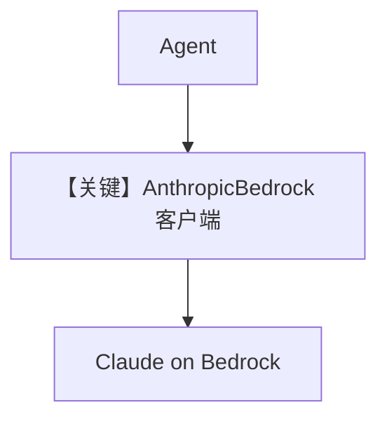

# basic.py — 实现原理分析

> 源文件：`cookbook/90_models/aws/claude/basic.py`

## 概述

本示例展示 **`agno.models.aws.Claude`**（继承 Anthropic `Claude`，走 **AnthropicBedrock** 客户端）与多种 **`print_response` / `aprint_response`** 模式。

**核心配置一览：**

| 配置项 | 值 | 说明 |
|--------|------|------|
| `model` | `Claude(id="global.anthropic.claude-sonnet-4-5-20250929-v1:0")` | Bedrock 上的 Claude |
| `markdown` | `True` | Markdown |

## 核心组件解析

### Aws Claude vs AwsBedrock

`aws/claude.py` 中 `Claude` 继承 `AnthropicClaude`，使用 **Anthropic 官方 Bedrock 适配器**（`AnthropicBedrock`），请求形态仍为 **Messages 风格**，与 `AwsBedrock` 的 **Converse** 不同。

### 运行机制与因果链

1. **路径**：与直连 Anthropic 类似，但 endpoint/credential 走 AWS。
2. **副作用**：AWS 计费与日志。
3. **定位**：要用 **Claude 在 Bedrock** 且与 Anthropic API 对齐时用本类；Nova 等用 `AwsBedrock`。

## System Prompt 组装

### 还原后的完整 System 文本

```text
Use markdown to format your answers.
```

## 完整 API 请求

经 `AnthropicBedrock` 客户端的 `messages.create`（或 async 等价），非 `converse`。

## Mermaid 流程图



## 关键源码文件索引

| 文件 | 关键函数/类 | 作用 |
|------|------------|------|
| `agno/models/aws/claude.py` | `Claude` L25+ | 继承 AnthropicClaude |
| `agno/models/anthropic/claude.py` | `invoke()` | 共用 |
