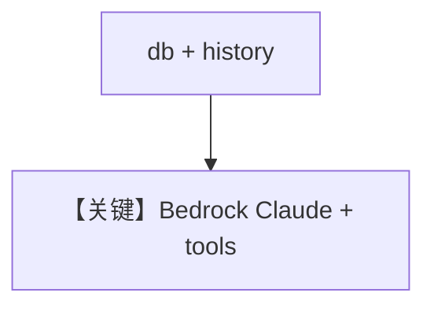

# db.py — 实现原理分析

<!-- cookbook-py-source:start -->
## 完整源码

```python
"""Run `uv pip install ddgs sqlalchemy anthropic` to install dependencies."""

from agno.agent import Agent
from agno.db.postgres import PostgresDb
from agno.models.aws import Claude
from agno.tools.websearch import WebSearchTools

# ---------------------------------------------------------------------------
# Create Agent
# ---------------------------------------------------------------------------

# Setup the database
db_url = "postgresql+psycopg://ai:ai@localhost:5532/ai"
db = PostgresDb(db_url=db_url)

agent = Agent(
    model=Claude(id="global.anthropic.claude-sonnet-4-5-20250929-v1:0"),
    db=db,
    tools=[WebSearchTools()],
    add_history_to_context=True,
)
agent.print_response("How many people live in Canada?")
agent.print_response("What is their national anthem called?")

# ---------------------------------------------------------------------------
# Run Agent
# ---------------------------------------------------------------------------

if __name__ == "__main__":
    pass
```

<!-- cookbook-py-source:end -->

> 源文件：`cookbook/90_models/aws/claude/db.py`

## 概述

**PostgresDb + Aws Claude + WebSearchTools + 历史**，与 anthropic `db.py` 同模式，区别仅在 **模型为 Bedrock Claude**。

**核心配置一览：**

| 配置项 | 值 | 说明 |
|--------|------|------|
| `model` | `Claude(id="global.anthropic.claude-sonnet-4-5-20250929-v1:0")` | Bedrock Claude |
| `db` | `PostgresDb(...)` | 持久化 |
| `tools` | `[WebSearchTools()]` | 搜索 |
| `add_history_to_context` | `True` | 历史 |

## System Prompt 组装

无显式 instructions；默认 markdown 可能为 False，请运行时确认。

## Mermaid 流程图



## 关键源码文件索引

| 文件 | 关键函数/类 | 作用 |
|------|------------|------|
| `agno/models/aws/claude.py` | `Claude` | 模型 |
