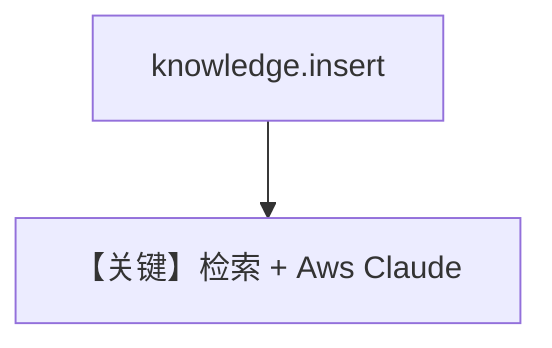

# knowledge.py — 实现原理分析

<!-- cookbook-py-source:start -->
## 完整源码

```python
"""Run `uv pip install ddgs sqlalchemy pgvector pypdf openai anthropic` to install dependencies."""

from agno.agent import Agent
from agno.knowledge.knowledge import Knowledge
from agno.models.aws import Claude
from agno.vectordb.pgvector import PgVector

# ---------------------------------------------------------------------------
# Create Agent
# ---------------------------------------------------------------------------

db_url = "postgresql+psycopg://ai:ai@localhost:5532/ai"

knowledge = Knowledge(
    vector_db=PgVector(table_name="recipes", db_url=db_url),
)
# Add content to the knowledge
knowledge.insert(url="https://agno-public.s3.amazonaws.com/recipes/ThaiRecipes.pdf")

agent = Agent(
    model=Claude(id="global.anthropic.claude-sonnet-4-5-20250929-v1:0"),
    knowledge=knowledge,
)
agent.print_response("How to make Thai curry?", markdown=True)

# ---------------------------------------------------------------------------
# Run Agent
# ---------------------------------------------------------------------------

if __name__ == "__main__":
    pass
```

<!-- cookbook-py-source:end -->

> 源文件：`cookbook/90_models/aws/claude/knowledge.py`

## 概述

**Knowledge + PgVector（默认 embedder）+ Aws Claude**，默认 `search_knowledge=True` 注入检索说明。

**核心配置一览：**

| 配置项 | 值 | 说明 |
|--------|------|------|
| `model` | `Claude(id="global.anthropic.claude-sonnet-4-5-20250929-v1:0")` | Bedrock |
| `knowledge` | `Knowledge(vector_db=PgVector(...))` | RAG |

## System Prompt 组装

动态知识段；无法静态还原全文。

## Mermaid 流程图



## 关键源码文件索引

| 文件 | 关键函数/类 | 作用 |
|------|------------|------|
| `agno/agent/_messages.py` | `# 3.3.13` | 知识上下文 |
| `agno/models/aws/claude.py` | `Claude` | 注意结构化能力标志在 `__post_init__` 被覆盖 |
